# Tham khảo đối thủ: ChillFit và LazyFit (UI, luồng, logic)

_Soạn 30/09/2026 từ 2 video quay màn hình (xem từng khung hình) và nghiên cứu web. Mục đích: khi chủ app nói "tham khảo đối thủ", file này trả lời được mọi câu hỏi về màn hình, tính năng, luồng và logic của hai app, không cần xem lại video._

> **Lưu ý về tên app (quan trọng).** Chỉ dẫn ban đầu ghi IMG_2132 là LazyFit và IMG_2136 là ChillFit. Nhưng chữ trên màn hình trong video cho thấy **ngược lại**:
> - **IMG_2132 = ChillFit**: ô ảnh chờ tải ghi "ChillFit" (00:05, 01:00), ảnh bìa bài nhạc trong sheet Music & Voice ghi "ChillFit" (00:27). Tab: My Plan · Library · Meal · Progress.
> - **IMG_2136 = LazyFit**: màn App Icons có icon chữ "LazyFit" đang chọn (00:31), hộp thoại Apple Health ghi "Find LazyFit and turn on the steps" (00:22), ô ảnh chờ tải ghi "lazyfit" (01:24), góc trang PDF có logo lazyfit. Tab: My Plan · Workouts · Meal · Explore.
>
> File này dùng tên theo bằng chứng trên màn hình. Nếu chủ app chắc chắn khác, chỉ cần đổi tiêu đề hai phần app; nội dung từng màn vẫn đúng với video tương ứng.
>
> Ký hiệu nguồn: **[Video]** = thấy trong video (kèm mốc mm:ss của video đó) · **[Web]** = từ website/App Store/Google Play, xem 30/09/2026 · **(suy luận)** = không thấy trực tiếp, đoán từ nhiều khung hình · "(không đọc rõ)" = chữ quá nhỏ hoặc bị che.

## Mục lục

1. [Tra nhanh](#tra-nhanh)
2. [ChillFit (IMG_2132)](#a-chillfit-img_2132)
   - A1 Nhận diện và phong cách · A2 Bản đồ điều hướng · A3 Từng màn hình · A4 Luồng chính · A5 Logic và quy tắc · A6 Kiếm tiền · A7 Website & store
3. [LazyFit (IMG_2136)](#b-lazyfit-img_2136)
   - B1 Nhận diện và phong cách · B2 Bản đồ điều hướng · B3 Từng màn hình · B4 Luồng chính · B5 Logic và quy tắc · B6 Kiếm tiền · B7 Website & store
4. [So sánh với Gentle Walk 50+](#c-so-sánh-với-gentle-walk-50)
5. [Ý tưởng áp dụng cho Gentle Walk](#ý-tưởng-áp-dụng-cho-gentle-walk)
6. [Không nên học theo](#không-nên-học-theo)
7. [Ảnh minh hoạ](#ảnh-minh-hoạ)
8. [Câu hỏi còn mở](#câu-hỏi-còn-mở)

## Tra nhanh

| Chủ đề | ChillFit (IMG_2132) | LazyFit (IMG_2136) |
|---|---|---|
| Đếm ngược trước buổi | A3.4, A3.5 (màn "Get Ready!" robot ~1,5 s rồi 3-2-1-GO, mỗi số ~1 s) | B3.14 (3-2-1-GO trong vòng tròn trên nền hồng, mỗi số ~1 s) |
| "Get Ready" xem trước động tác kế | A3.7 (10 s, số to đè lên video) | B3.15 (15 s, "Next Up:", nút Guidance + Skip) |
| Nghỉ giữa động tác | A3.7 (không có nghỉ riêng, chỉ Get Ready 10 s) | B3.15 (Get Ready 15 s đóng vai nghỉ) |
| Player: điều khiển | A3.6 | B3.16 |
| Hướng dẫn động tác (How to Do) | A3.8 | không thấy trong video |
| Nhạc và giọng | A3.9 (sheet Music & Voice) | B3.15 (nút Guidance), B3.13 (icon nhạc trên màn chi tiết) |
| Cast lên TV | A3.10 (chỉ là hướng dẫn Screen Mirroring) | icon AirPlay trên player (B3.15), không mở trong video |
| Tạm dừng | A3.11 | B3.16 |
| Hộp thoại thoát | A3.12 ("Hold on! You got this!") | B3.17 ("Hang in there You can do it!") |
| Màn hoàn thành | A3.13 | B3.18, huy hiệu B3.19 |
| Calo | A3.13, A3.14, A5.6 | B3.18, B3.20, B5.6 |
| Streak, huy hiệu, check-in | A3.14, A3.28 (Awards) | B3.19, B3.31 (Badges) |
| Tiến độ, lịch tuần, cảm xúc | A3.14, A3.28 | B3.20, B3.31 |
| Ghi hoạt động tay, cân nặng | A3.29, A3.28 | B3.31 |
| Thư viện, duyệt bài | A3.15, A3.20 | B3.24, B3.25, B3.27 |
| Kế hoạch 28 ngày, danh sách ngày | A3.1, A3.2, A3.3 | B3.10, B3.12, B3.22, B3.23 |
| PDF in được | A3.15 (Printable Plan) | B3.26 (Printable Guides, mở PDF trong app) |
| Tải bài trước khi tập | A3.16 ("Downloading…") | B3.13 ("Downloading workout") |
| Thực đơn và quiz ăn uống | A3.23–A3.27 | B3.29 |
| Paywall | không thấy trong video; web: A7 | B3.11 ("Special Discount 20% OFF"); web: B7 |
| Cài đặt | A3.30 | B3.1–B3.9 |
| Nhắc tập | "Reminder" trong Settings (A3.30, không mở) | B3.4 ("Remind Me to Exercise") |
| Đo nhịp tim | nút "Measure Heart Rate" (A3.3, A3.13), không mở | nút "Measure Heart Rate" (B3.13, B3.18), không mở |
| Góp ý nội dung | "Suggest Workouts", "Suggest Meal Plan" (A3.20, A3.27) | "Suggest a Program" (B3.30) |

---

## A. ChillFit (IMG_2132)

Video: 166 s, dọc 592×1280, quay ngày 29/09/2026 lúc 17:20–17:23 (đồng hồ trạng thái).

### A1. Nhận diện và phong cách

- **Tên:** ChillFit (theo chữ trên màn). App Store id 6754075317 theo `app-context.md`. Phiên bản thấy ở cuối Settings: "v 1.4.5" **[Video 02:45]**.
- **Thể loại:** Health & Fitness, tập tại nhà: pilates, chair cardio, đi bộ trong nhà, tai chi, kegel, yoga "lười", tập trên giường/sofa; có thực đơn.
- **Người dùng nhắm tới (suy luận):** phụ nữ trung niên muốn giảm cân, mới tập. Ảnh bìa có cả phụ nữ trẻ và 50+ (Printable Plan "Chair Yoga" là phụ nữ tóc bạc ngồi ghế). Tên bài thiên về giảm cân: "Pilates for weight loss", "Steps to Slim Down", "Toned Body Burn", "Lose Weight".
- **Màu (lấy mẫu pixel):**
  - Chính: đỏ cherry `#E50645` (nút Start, Finish, Keep Exercising, số nhấn).
  - Nút gradient phụ: hồng magenta → đỏ (Start Now, Get Meal Plan, + Log Weight), khoảng `#E8157F` → `#EE2A3A` (ước lượng).
  - Nền: xám rất nhạt `#F7F7F7`; thẻ trắng `#FFFFFF`; nút phụ xám `#EDEDED` (ước lượng).
  - Màn đếm ngược: gradient tím mận tối `#340C2F` → `#140D1D`.
  - Chữ chính gần đen `#1A1A1A` (ước lượng), chữ phụ xám `#8A8A8A` (ước lượng).
- **Chữ:** sans hình học, đậm (giống Poppins). Tiêu đề kế hoạch viết HOA đậm ("PILATES FOR WEIGHT LOSS"). Số đếm giờ rất to, đậm ("00:30" chiếm ~1/5 bề ngang). Số đếm ngược 3-2-1 in nghiêng đậm.
- **Bo góc:** thẻ ngày ~16 pt; nút chính ~14 pt (gần viên thuốc); chip ~12 pt; tab bar là viên thuốc nổi, bo tròn hẳn, đổ bóng.
- **Hình ảnh:** ảnh chụp người mẫu thật trong phòng sáng (studio trắng hoặc phòng khách), video lặp động tác trên nền trắng; emoji 3D (ngón cái, lửa, bắp tay, đồng hồ); mascot robot trắng mặt đen mắt cười (màn Get Ready!, màn tạo thực đơn).
- **Sáng/tối:** giao diện sáng; chỉ màn đếm ngược là nền tối.

### A2. Bản đồ điều hướng

Tab bar nổi dưới cùng, 4 tab: **My Plan · Library · Meal · Progress**.

```
My Plan (kế hoạch 28 ngày theo Stage)
 ├─ chạm thẻ ngày / "Start Now" → Chi tiết ngày (DAY 2) → Start
 │     → [Get Ready! robot] → 3-2-1-GO → Player ⇄ Get Ready động tác kế
 │           ├─ (i) → sheet How to Do
 │           ├─ ♫ → sheet Music & Voice
 │           ├─ cast → sheet Cast Workout
 │           └─ ‹ → Hold on! → Keep Exercising | Restart This Exercise | Quit
 │                                   Quit / hết bài → Màn hoàn thành → Finish → tab Progress
 ├─ ♡ (My Favorites) · ⟲ (lịch sử) · ⚙︎ thanh trượt (Plan Settings)   [không mở trong video]
Library → thẻ bài → Chi tiết bài → Start ("Downloading…") → 3-2-1-GO → Player → …
Meal → (lần đầu) màn upsell "3× Effect" → quiz 7 câu → "Generating…" → Meal Plan tuần
Progress → Total Calories, cảm xúc, lịch tuần, Activities, Calories Burned, Awards, Weight
   ├─ + Log Activities → sheet danh sách môn → sheet nhập (Date, Duration) → Save
   ├─ + Log Weight
   └─ ⚙︎ (góc phải trên) → Settings
```

Chi tiết bài mở dạng màn đẩy (push) có nút ‹. Player mở toàn màn hình, trượt từ dưới lên (suy luận từ 00:10–00:11). Màn hoàn thành đóng bằng cách trượt xuống, lộ tab Progress **[Video 00:37]**.

### A3. Từng màn hình

#### A3.1 My Plan, Stage 2 (00:00–00:01)
- **Trên cùng:** tiêu đề 2 dòng HOA đậm "PILATES FOR WEIGHT LOSS", dòng xám "28-DAY". Bên phải 3 icon viền: ♡ (yêu thích), đồng hồ có mũi tên (lịch sử), thanh trượt (cài đặt kế hoạch).
- **Nhóm:** "STAGE 2" đậm, phụ đề xám "Burn fat", bên phải 3 tia sét (2 đỏ, 1 xám) = mức cường độ.
- **Danh sách ngày:** đường chấm dọc bên trái với vòng tròn trống cho mỗi ngày. Mỗi thẻ trắng cao ~150 px (trên 1280): "Day 6" to đậm, "6 min | 40 kcal", ảnh vuông bên phải. Thấy: Day 6 6 min | 40 kcal · Day 7 6 min | 36 kcal · Day 8 6 min | 42 kcal · Day 9 6 min | 42 kcal · Day 10 6 min | (không đọc rõ).
- **Nút nổi:** viên thuốc đỏ "Back to Today" có mũi tên lên, nằm trên tab bar, chỉ hiện khi cuộn xa ngày hiện tại (suy luận).
- **Tab bar:** My Plan (đang chọn: icon và chữ đỏ, nền xám nhạt), Library, Meal, Progress.

#### A3.2 My Plan, Stage 1 và ngày hôm nay (00:02–00:04)
- "STAGE 1", "Energize body", 1/3 tia sét đỏ.
- Day 1 "3 min | 29 kcal": vòng tròn trái có dấu tick trắng trên nền hồng, ảnh có huy hiệu tick đỏ = đã tập.
- **Ngày hiện tại mở rộng:** thẻ lớn ảnh nền, "DAY 2" rất to, "3 min | 31 kcal", nút gradient "Start Now" rộng hết thẻ. Vòng tròn trái đỏ có ▶.
- Day 3 "3 min | 20 kcal", Day 4 "6 min | 41 kcal": vòng tròn trống.
- **Quy tắc thấy được:** Stage 1 là bài 3 phút, Stage 2 là 6 phút; chỉ một ngày được mở rộng (hôm nay).

#### A3.3 Chi tiết ngày "DAY 2" (00:05–00:10)
- **Nửa trên:** ảnh người mẫu tràn viền (ngồi xếp bằng, nghiêng người). Nút ‹ tròn mờ trên trái. Cột phải 3 nút tròn mờ: ♫ (nhạc), đồng hồ bấm giờ (không mở; có thể là chỉnh thời lượng), ♡.
- "DAY 2" rất to giữa màn, "3 min | 31 kcal" xám.
- Nút đỏ "Start" có vòng tròn → bên phải. Dưới là nút xám "Measure Heart Rate".
- "6 Exercises", mỗi dòng: ảnh vuông bo góc (lúc đầu là ô xám ghi "ChillFit", rồi ảnh tải vào), tên, thời lượng "00:30".
- Danh sách đủ (cuộn 00:08): Side Leg Circles Left · Side-Lying Leg Lift Left · Side Leg Circles Right · Side-Lying Leg Lift Right · Scissors · Bent Leg Twist, đều "00:30".
- **Khi cuộn:** ảnh thu lại, tiêu đề "DAY 2" thành tiêu đề thanh điều hướng, nút "Start" dính ở đáy màn.

#### A3.4 "Get Ready!" có robot (00:10–00:12)
- Nền gradient tím mận tối. Trên trái nút ‹ tròn, trên phải nút xoay/toàn màn.
- "Get Ready!" rất to, trắng, căn trái-giữa, chiếm ~80% bề ngang.
- Giữa màn: robot trong vòng sáng hồng-xanh gợn sóng như sóng âm (hoạt hình), gợi ý giọng HLV đang nói.
- Nút viên thuốc xám mờ "Skip" ở dưới.
- Thời gian: chữ mờ vào ~00:10,75, biến mất ~00:12,2 → hiện ~1,5 s rồi tự sang đếm ngược **[Video, lấy mẫu 4 khung/giây]**.
- Màn này **chỉ thấy ở buổi đầu (bài trong kế hoạch)**; hai buổi mở từ Library (01:03, 01:35) vào thẳng 3-2-1 (suy luận: chỉ bài kế hoạch có intro, hoặc chỉ lần đầu trong ngày).

#### A3.5 Đếm ngược 3-2-1-GO (00:12–00:16)
- Cùng nền tối, vòng tròn đồng tâm rất mờ quanh tâm.
- Số trắng in nghiêng đậm cao ~15% màn: "3", "2", "1", "GO". Số phóng to từ nhỏ khi xuất hiện (thấy "3" nhỏ ở 01:36).
- Mỗi số ~1 s (4 khung liên tiếp ở 4 fps), "GO" ~1 s. Không có nút Skip trong lúc đếm.
- Tổng từ bấm Start tới động tác đầu: ~5,5 s ở buổi có intro; ~4 s + thời gian tải ở buổi từ Library.

#### A3.6 Player động tác (00:16–00:19)
- **Trên cùng:** thanh tiến độ chia đoạn, mỗi đoạn = một động tác (6 đoạn cho bài 6 động tác; 23 và 30 đoạn mảnh cho bài 23 và 30 động tác). Đoạn đã xong tô đỏ.
- Nút ‹ tròn mờ trên trái (thoát). Cột phải 4 nút tròn mờ: toàn màn/xoay, cast (màn hình có tam giác), ♫, (i).
- **Video:** người mẫu mặc đồ đen trên thảm xám, nền trắng, chiếm ~55% trên. Dưới video bên phải: 👎 và 👍 nhỏ (đánh giá động tác).
- **Đồng hồ:** "00:30" rất to, đậm, giữa màn; tên động tác "Side Leg Circles Left" dưới. Đếm lùi mỗi giây.
- **Thanh điều khiển:** viên thuốc xám nhạt rộng gần hết màn, phần đỏ lan từ trái sang = thời gian đã qua của động tác. Giữa ⏸, phải ⏭. Động tác đầu không có ⏮.

#### A3.7 "Get Ready" động tác kế (00:20–00:23, 00:28, 00:31)
- Xuất hiện khi bấm ⏭ lúc 00:27 (còn 27 s động tác 1) → nhảy sang động tác 2.
- Video động tác kế chạy sẵn, số trắng rất to đè lên video bên trái: "10", "9", "8", "7"… mỗi giây một số.
- "Get Ready" to đậm, tên động tác kế "Side-Lying Leg Lift Left".
- Thanh điều khiển có đủ ⏮ ⏸ ⏭, phần đỏ lan theo 10 s.
- Đoạn 1 của thanh trên cùng đã đỏ.
- **Ý nghĩa:** đây là khoảng chuyển 10 s giữa hai động tác, vừa là nghỉ vừa xem trước. Không có màn "Rest" riêng.

#### A3.8 Sheet "How to Do" (00:24–00:25)
- Mở khi bấm (i). Sheet trắng cao ~75% màn, bo góc trên ~24 pt, nền sau tối đi.
- Trên cùng: video động tác lặp, nút loa tròn trên phải (bật/tắt tiếng hướng dẫn).
- Tiêu đề "Side-Lying Leg Lift Left", mục "How to Do", danh sách số:
  1. "Lie down on your side with your head rested on your right arm. Lift your upper leg up and return to the start position."
  2. "Make sure your left leg goes straight up and down during the exercise."
  3. "It's a great exercise for the gluteus."
- Nút đỏ "Close" dưới cùng.
- Số đếm Get Ready đang 7 trước khi mở, 6 sau khi đóng → đồng hồ gần như dừng khi sheet mở (suy luận).

#### A3.9 Sheet "Music & Voice" (00:26–00:27)
- Tiêu đề "Music & Voice", nút ✕ tròn xám.
- Thẻ 1: "Music" + công tắc đỏ (bật). Dòng bài: ảnh tròn tím "ChillFit", "Energy Pulse", "00:17/02:55" có icon sóng, › (chọn bài khác). Thanh âm lượng nhạc (đỏ tới giữa).
- Dòng "Other Audio" có icon Apple Music và Spotify, › (dùng nhạc app khác).
- Thẻ 2: "Voice Guide" + công tắc đỏ (bật), thanh âm lượng giọng.
- Quy tắc: nhạc và giọng là hai kênh riêng, mỗi kênh có bật/tắt và âm lượng riêng.

#### A3.10 Sheet "Cast Workout" (00:29)
- Tiêu đề "Cast Workout", hình iPhone minh hoạ player (ghi "x12 Squats" → có động tác đếm số lần, không chỉ đếm giờ).
- Chữ đậm: "Keep your phone and TV in the same Wi-Fi environment."
- Bước: "1 Open Control Center" · "2 Tap Screen Mirroring and select your device" · "3 Watch the workout on TV!"
- Nút đỏ "Got It!".
- **Logic:** app không tự cast, chỉ hướng dẫn dùng Screen Mirroring của iOS.

#### A3.11 Trạng thái tạm dừng (00:30)
- Bấm ⏸: cả màn phủ lớp xám mờ, số đếm đứng ở "5", nút giữa đổi thành ▶, ⏮ ⏭ mờ đi. Không có chữ "Paused". Bấm ▶ chạy tiếp từ 4.

#### A3.12 Hộp thoại thoát "Hold on!" (00:32–00:33; lặp lại 01:13, 01:43)
- Mở khi bấm ‹ trong player. Lớp trắng gần đục phủ cả màn (player mờ phía sau).
- Emoji 🔥 lớn, "Hold on!" / "You got this!" rất to đậm 2 dòng.
- "Just **4 exercises** left" (số và chữ "exercises" màu đỏ).
- Nút: "Keep Exercising" (đỏ, đặc) · "Restart This Exercise" (xám) · "Quit" (chữ xám, không nền).
- Số "left": 4 khi đang ở động tác 2/6; 22 khi ở động tác 1/23; 29 khi ở 1/30 → **left = tổng − thứ tự động tác hiện tại** (suy luận).

#### A3.13 Màn hoàn thành (00:34–00:36; biến thể 01:15, 01:45)
- Nền trắng chuyển hồng nhạt ở đáy, pháo giấy rơi, ngón cái 3D trên đốm hồng, icon chia sẻ trên phải.
- Tiêu đề thay đổi theo lần: "Consistency builds results!" (00:35) · "Fantastic effort today!" (01:15) · "Great consistency!" (01:45).
- 3 ô trắng bo góc: 💪 "2" "Exercises" · 🔥 "1" "Kcal" · ⏰ "1" "Min".
- "You have persisted for **2 days**" (đỏ).
- "Finish" (đỏ đặc) · "Measure Heart Rate" (viền đỏ).
- **Quan trọng:** màn này hiện cả khi người dùng bấm Quit giữa chừng (sau 3 s hoặc 25 s tập), vẫn có pháo giấy và lời khen.
- Hoạt hình: nền và pháo giấy vào trước, số liệu hiện sau ~0,5 s (01:45).

#### A3.14 Progress ngay sau khi Finish (00:37–00:38)
- "Progress" trên trái; phải: icon ghi chú có bút, icon ⚙︎.
- Ngọn lửa gradient đỏ-cam, số trắng "2" bên trong, dưới "Total Calories".
- Thẻ "How are you feeling today?": 4 emoji tròn "Tired", "Relaxed", "Proud", "Energized".
- Dải tuần "Sep 28 - Oct 04" có ◀ ▶; Mon…Sun, hôm nay Tue 29 có vòng đỏ và số trên nền hồng.
- "Check-in Days: **2**".

#### A3.15 Library, phần trên (00:39–00:47)
- "Just For You" + "All ›" (đỏ). Băng chuyền ngang các thẻ lớn (~85% bề ngang, bo ~20 pt): huy hiệu "28 DAY" trên trái, tên trắng đậm dưới trái, thanh tiến độ mảnh + "4%", nút đỏ "Start". Thấy: Calisthenics Sculpt (4%) · Gentle Chair Cardio · Tai Chi Walking · Gentle Tai Chi Flow · All Standing Cardio · Toned Beach Body.
- "Workout Type": chip xám 2 hàng cuộn ngang: Chair Cardio · Focus Area · Kegel · Stress Melt · Lazy Pilates · Wall Pilates · … (còn nữa bên phải).
- "Printable Plan" + "All ›": thẻ ảnh có nhãn đỏ "PDF": Chair Yoga · Tai Chi Walking · Chair Tai (chi) · Military Calisthenics · Mat Pilates.
- "Focus Area": ảnh tròn cắt vùng cơ thể: Abs · Full Body · Arm · Butt.
- "Chair Cardio" + "All ›": banner gradient tím "ENERGETIC CHAIR AEROBICS · 4 Workouts", hồng "FULL BODY CHAIR CARDIO · 4 Workouts".

#### A3.16 Chi tiết bài từ Library + tải về (01:00–01:03; 01:32–01:35)
- Như A3.3 nhưng cột phải chỉ có ♫ và ♡. "Steps to Slim Down", "12 min | 116 kcal", "23 Exercises": Side Step With Arm Lift 00:30 · Weight Shift With Side Reach 00:30 · …
- Bấm Start → nút đổi thành "Downloading…" nền hồng nhạt, phần đỏ lan từ trái = % tải. ~2,5 s. Xong đổi lại "Start →" rồi tự vào đếm ngược.
- "Toned Body Burn", "14 min | 221 kcal", "30 Exercises": Single Leg Hip Rotation 00:30 · Knee To Elbow Crunches 00:30 · …

#### A3.17 Buổi 2: đếm ngược, player, thoát (01:04–01:14)
- 3-2-1-GO (không có màn robot), player "Side Step With Arm Lift" 00:30 → 00:26 (video phòng tập gỗ sáng).
- 01:13 hộp thoại "Just 22 exercises left" → Quit → 01:14 player mờ dần (đứng ở 00:26, nút ▶) → 01:15 "Fantastic effort today!" 1 · 1 · 1.
- 01:17 Progress "3" Total Calories.

#### A3.18 Buổi 3 (01:36–01:47)
- 3-2-1-GO, player "Single Leg Hip Rotation" 00:29 → 00:28, 01:43 "Just 29 exercises left" → Quit → "Great consistency!" 1 · 1 · 1 → Progress "4".

#### A3.19 Hoạt hình và chuyển màn
- Player vào bằng trượt từ dưới; đếm ngược số phóng to; màn hoàn thành pháo giấy; ngọn lửa Progress có tia lửa nhỏ bay; nút tải có thanh lan. Không thấy rung/âm thanh (video có tiếng nhưng tài liệu này không phân tích âm thanh).

#### A3.20 Library, phần dưới (00:48–00:59; 01:19–01:31)
Mỗi hàng: tiêu đề nhóm + "All ›", thẻ ngang ~60% bề ngang, ảnh + ♡ + tên + "x min | y kcal" (kcal màu đỏ).

| Nhóm | Bài thấy (thời lượng, kcal) |
|---|---|
| Kegel Exercises | Intro to Kegel 6 min 48 kcal · Kegel Level Up 8 min 86 kcal · Kegel Mastery 12 min 119 kcal |
| Seated Pilates | Seated Active Pilates 5 min 20 kcal · Mindful Pilates 6 min 28 kcal |
| (không đọc rõ tên nhóm) | Mindful Pilates Flow 6 min 28 kcal · Strength Pilat(es) 9 min 35 kcal |
| Chair Workout | Restore And Refresh 13 min 97 kcal · Seated Total (…) 10 min 84 kcal |
| Indoor Walking | Walk for Health 9 min 90 kcal · Steps to Slim Down 12 min 116 kcal · Home Fitness (…) 12 min 116 kcal |
| Happy Cardio | Indoor Cardio 8 min 135 kcal · Total Body Ae(robics) 10 min 108 kcal |
| Bed & Sofa Workouts | (ảnh, không đọc rõ tên) |
| Pain Release | Tension Release Routine 13 min 94 kcal · Gentle Pain R(elief) 15 min 112 kcal |
| Daily Stretch | Flex & Flow Wellness 6 min 44 kcal · Deep Body Str(etch) 6 min 35 kcal |
| Stress Melt | Inner Peace Relaxation 14 min 101 kcal · Mind-Body Se(…) 10 min 68 kcal |
| Lazy Pilates | Strong Core Pilates 8 min 77 kcal · Posture Fix W(…) 5 min 42 kcal |
| Wall Pilates | Strength And Stability 12 min 112 kcal · Wall Flow Jou(rney) 12 min 116 kcal |
| Mindful Reset | Journey Through Nature 12 min · Gentle Mindfu(l…) 12 min (không ghi kcal) |
| Afternoon Recharge | Energy Reset 11 min 108 kcal · Energy Lift 11 min 122 kcal |
| Lose Weight | Toned Body Burn 14 min 221 kcal · Calorie Burning 5 min 66 kcal · Total Shape Up 13 min 163 kcal · Burn & Shap(e) 13 min 97 kcal |
| For Beginner | Start Simple 5 min 47 kcal · Newbie Workou(t) 4 min 40 kcal |
| Lazy Yoga | Cozy Morning Yoga 10 min 55 kcal · Flow With Yog(a) 11 min 76 kcal |
| Chair Yoga | Morning Chair Yoga 7 min 58 kcal · Seated Soft Y(oga) 11 min 68 kcal |

- Cuối trang: nút trắng rộng "Suggest Workouts".
- Nhận xét: kcal không nhất quán với thời lượng ("Calorie Burning" 5 min 66 kcal nhưng "Seated Active Pilates" 5 min 20 kcal; "Toned Body Burn" 14 min 221 kcal).

#### A3.21 Thẻ yêu thích
- Mọi thẻ Library có ♡ ở góc; không thấy bấm trong video.

#### A3.22 Ghi chú về video (mọi màn)
- Vòng tròn xám ở góc phải dưới là AssistiveTouch của máy quay, không thuộc app.

#### A3.23 Meal, màn upsell lần đầu (01:48–01:50)
- "Meal Plan" trên trái. Biểu đồ động: cột xám thấp "Workout" có 😊, cột hồng cao "Workout & Meal" có 😆, mũi tên đỏ cong và chữ đỏ "3× Effect". Cột hồng mọc lên (hoạt hình 01:48 → 01:50).
- "Eat Smarter to Get 3× Better Results!" (đậm), "Proper nutrition boosts fat loss. Take a quick quiz for your custom meal plan".
- Nút gradient "Get Meal Plan".

#### A3.24 Quiz thực đơn, 7 câu (01:51–02:08)
- Khung chung: thanh tiến độ đỏ mảnh trên giữa, ✕ tròn xám trên phải, ‹ trên trái từ câu 2. Tiêu đề câu hỏi to, căn giữa.
1. "What's your dietary preference?" — No Preference · Balanced · Low Carbs · Vegetarian · Vegan · Mediterranean · High Protein (chọn một, tự sang câu kế).
2. "Do you have any allergies?" — No Allergies · Gluten · Dairy · Nut · Seafood · Egg (chọn nhiều; "Next" mờ tới khi chọn; ô chọn viền đỏ, nền hồng nhạt).
3. "Please select the foods you like" — lưới 3 cột icon 3D: Egg · Olive oil · Garlic · Broccoli · Spinach · Cheddar cheese · Salmon · Coconut cream · Chicken breast · … (chọn nhiều, "Next").
4. "Please select the foods you **don't like**" ("don't like" màu đỏ) — Bell pepper · Cheddar cheese · Onion · Egg · Salmon · Chia seeds · Shrimp · Olive oil · Beef · …
5. "How many meals do you typically have per day?" — No Preference · Three Meals (Breakfast, Lunch, Dinner) · Four Meals (Breakfast, Lunch, Dinner, Snack) (lựa chọn nằm sát đáy màn).
6. "What is your current cooking skill level?" — Beginner · Intermediate · Advanced.
7. "How much time can you spend cooking each day?" — Less than 30 minutes · 30 minutes to 1 hour · 1 hour to 2 hours · More than 2 hours.

#### A3.25 "Generating your personalized meal plan..." (02:08–02:21)
- Nền trắng-hồng, robot trên cùng. 3 bước, mỗi bước có thanh sọc đỏ chạy 0 → 100% rồi thu thành vạch đầy và dấu ✔: "Dietary preference: Balanced" · "Allergy: Gluten" · "Analyzing metabolism: 1556.2 kcal".
- Tổng ~13 s. Rồi HUD quay vòng tối ~1 s.
- (Khoảng 02:12 có một thông báo iOS cá nhân chen vào; không thuộc app, bỏ qua.)

#### A3.26 Meal Plan theo tuần (02:21–02:24)
- "Meal Plan", "Sep, 2026", icon thanh trượt (lọc) trên phải.
- Dải ngày: "29 Tue" (nền hồng, chấm đỏ), 30 Wed, 1 Thu, 2 Fri, 3 Sat, 4 Sun, 5 Mon.
- Thẻ ảnh món tràn ngang, nhãn góc trên trái: "BREAKFAST" (xanh lá) "Corn Tortilla Breakfast Tacos" "15 min" "320 kcal" · "LUNCH" (cam) "30 min" "610 kcal" (tên không đọc rõ) · "Gochujang Turkey Grilled Casserole" "40 min" "450 kcal".
- Ảnh tải chậm: khung xám trước, ảnh hiện sau ~1 s.

#### A3.27 Cuối Meal Plan (02:24)
- Hộp trắng: icon tim chữ thập, "MORE RECIPES COMING SOON!".
- Miễn trừ: "These recipes support everyday wellness, not medical advice. Consult a healthcare professional for health issues or specific dietary needs before use."
- Nút trắng "Suggest Meal Plan".

#### A3.28 Progress đầy đủ (02:25–02:40)
Từ trên xuống:
1. Ngọn lửa "5" "Total Calories".
2. "How are you feeling today?" (4 emoji).
3. Lịch tuần + "Check-in Days: 2".
4. "Activities" + "All ›": thẻ "Sep 29, 2026", "3 min Duration", "3 kcal Calories"; danh sách: "Workouts · Toned Body Burn · 1 min | 1 kcal", "Workouts · Steps to Slim Down · 1 min | 1 kcal", "Pilates · Day 2 · 1 min | 1 kcal"; nút viền đỏ "+ Log Activities".
5. "Calories Burned": "Sep 28 - Oct 04", 7 cột dọc M T W T F S S, cột T đỏ, tam giác đỏ dưới hôm nay.
6. "Awards" ›: 3 huy hiệu: khối lục giác hồng số 1 "1-Day Streak", huy hiệu đỏ số 2 "2 Days", vòng xám số 10 "10 Minutes" (chưa đạt).
7. "Weight": "Sep 2026" ◀ ▶, biểu đồ đường hồng 71.0–73.0, vạch "↓ Goal:62.0", trục Aug 31 · Sep 15 · Sep 29; nút gradient "+ Log Weight".
- Mâu thuẫn quan sát: Total Calories "5" nhưng Activities hôm nay "3 kcal" (có thể cộng ngày trước; ngày trước không thấy).

#### A3.29 Log Activities (02:30–02:37)
- Sheet "Log Activities" + ✕: "Popular": Walking · Running · Cycling · Yoga · Swimming; mục chữ cái "A": Aerobic Gymnastics · Archery; "B": Badminton · Baseball · Basketball · Billiards · Bowling · Boxing; "C"… Mỗi dòng có icon đỏ và ›.
- Chọn "Walking" → sheet thứ hai chồng lên: "Walking", "Date" "Sep 29, 2026" (ô xám), "Duration" ô nhập viền hồng + "min", nút "Save" hồng nhạt (mờ khi chưa nhập). Người quay đóng, không lưu.

#### A3.30 Settings (02:41–02:45)
- Mở từ ⚙︎ trên tab Progress. "Settings" giữa, ‹.
- **Account:** "Log In" / "Log in to sync your data".
- **Premium:** "Manage My Premium" (icon vương miện).
- **Workout:** "Plan Settings" · "My Favorites" · "Removed Exercises".
- **General:** "My Profile" · "Reminder" · "Language" · "Apple Health" · "FAQ".
- **Support Us:** "Share with Friends" · "Feedback" · "Privacy Policy" · "Terms Of Use".
- "v 1.4.5" xám giữa đáy. Không mục nào được mở.

### A4. Luồng chính (ChillFit)

**Luồng tập theo kế hoạch** (00:00–00:38)
1. My Plan: cuộn tới hôm nay (hoặc bấm "Back to Today").
2. Bấm thẻ Day 2 → chi tiết ngày (xem 6 động tác, 3 min | 31 kcal).
3. Bấm "Start" → player trượt lên.
4. "Get Ready!" với robot ~1,5 s (có "Skip").
5. 3 → 2 → 1 → GO, mỗi số ~1 s.
6. Động tác 1, đếm lùi 30 s; có thể ⏭ để bỏ.
7. "Get Ready" 10 s xem trước động tác kế (có ⏮ ⏸ ⏭).
8. Trong lúc tập: (i) xem How to Do; ♫ chỉnh nhạc/giọng; cast xem hướng dẫn; ⏸ dừng.
9. Bấm ‹ → "Hold on! You got this! Just N exercises left" → "Quit".
10. Màn hoàn thành (pháo giấy, 3 số, "You have persisted for 2 days") → "Finish".
11. Về tab Progress: Total Calories tăng, lịch tuần, check-in.

**Luồng duyệt thư viện** (00:39–01:03, 01:19–01:35)
1. Tab Library: băng chuyền "Just For You" (kế hoạch 28 ngày có % tiến độ) → chip "Workout Type" → PDF → Focus Area → các hàng theo nhóm.
2. Cuộn ngang trong hàng, "All ›" để xem cả nhóm (không mở trong video).
3. Bấm thẻ → chi tiết bài → "Start" → "Downloading…" → đếm ngược → player.

**Luồng thực đơn** (01:48–02:24): Meal → upsell "3× Effect" → "Get Meal Plan" → 7 câu → màn tạo ~13 s → thực đơn tuần theo ngày → "Suggest Meal Plan".

**Luồng ghi hoạt động tay** (02:30–02:37): Progress → "+ Log Activities" → chọn môn → Date + Duration → Save.

**Luồng cài đặt:** Progress → ⚙︎ → Settings (không đi sâu).

### A5. Logic và quy tắc (ChillFit)

1. **Đếm ngược đầu buổi** [Video]: intro "Get Ready!" ~1,5 s (chỉ thấy ở bài kế hoạch), rồi 3-2-1-GO, mỗi số ~1 s. Không có âm báo nhìn thấy được; không có nút bỏ qua trong lúc đếm số.
2. **Động tác theo giờ** [Video]: mọi động tác thấy được là 30 s, đếm lùi từng giây; thanh đỏ dưới là tiến độ của động tác. Có động tác đếm số lần ("x12 Squats" trong hình minh hoạ cast) (suy luận: có hai kiểu).
3. **Chuyển động tác** [Video]: "Get Ready" 10 s xem trước động tác kế; không có nghỉ riêng. Thời lượng ghi trên thẻ (3 min cho 6 × 30 s) gần bằng 6 × (30 + 10) s = 4 phút → thời lượng hiển thị có lẽ chỉ tính thời gian tập (suy luận).
4. **Bỏ qua** [Video]: ⏭ trong động tác nhảy sang Get Ready của động tác kế; ⏮ có từ động tác 2.
5. **Tạm dừng** [Video]: phủ xám, số đứng yên, ▶ để chạy tiếp; mở sheet (i) hay ♫ cũng dừng đồng hồ (suy luận, lệch ≤ 1 s).
6. **Calo** [Video]: mỗi bài ghi sẵn kcal cố định; khi thoát sớm vẫn ghi 1 kcal và 1 min (làm tròn lên tối thiểu 1). Total Calories trên Progress cộng dồn (2 → 3 → 4 → 5 sau mỗi buổi thoát sớm). Con số kcal không nhất quán giữa các bài.
7. **Thoát** [Video]: ‹ → hộp thoại 3 lựa chọn; "Quit" vẫn dẫn tới màn chúc mừng và ghi buổi vào Activities.
8. **Streak/check-in** [Video]: "You have persisted for 2 days" = số ngày có tập (không nhất thiết liên tiếp; suy luận vì lịch chỉ thấy hôm nay). "Check-in Days: 2". Huy hiệu "1-Day Streak", "2 Days", "10 Minutes".
9. **Kế hoạch 28 ngày** [Video]: chia Stage (Stage 1 "Energize body", Stage 2 "Burn fat"), cường độ bằng tia sét; ngày đã tập có tick; ngày hôm nay mở rộng. Day 2 được tính "đã tập" dù chỉ làm 2/6 động tác (Activities ghi "Pilates · Day 2") (suy luận: kế hoạch có thể tiến sang ngày sau).
10. **Tải bài** [Video]: video từng bài tải khi bấm Start ("Downloading…"), ~2,5 s trên Wi-Fi.
11. **Tiến độ kế hoạch** [Video]: thẻ "Just For You" có % (Calisthenics Sculpt 4%).
12. **PDF** [Video]: nhóm "Printable Plan" gắn nhãn PDF (không mở trong video này).
13. **Nhạc** [Video]: nhạc riêng của app (bài "Energy Pulse" 2:55) hoặc "Other Audio" (Apple Music, Spotify); giọng hướng dẫn bật/tắt và chỉnh âm lượng riêng.
14. **Thực đơn** [Video]: quiz → tính "metabolism" 1556.2 kcal → thực đơn 7 ngày theo bữa, có kcal và phút nấu; có miễn trừ y khoa.
15. **Tài khoản** [Video]: dùng được không đăng nhập; "Log in to sync your data" là tuỳ chọn.

### A6. Tín hiệu kiếm tiền (ChillFit, trong video)
- Settings có mục "Premium" / "Manage My Premium" → app có gói trả phí; người quay có vẻ đang có quyền dùng (không thấy khoá, không thấy paywall).
- Không thấy biểu tượng khoá hay nhãn Pro trong thư viện.
- Màn Meal mở đầu bằng upsell nội dung ("3× Better Results") nhưng không đòi trả tiền trong video.
- Chi tiết giá: xem A7 (web).

### A7. Website & store (ChillFit)

**Toàn bộ mục này là [Web], xem ngày 30/09/2026.** Nguồn:
- [C1] https://itunes.apple.com/lookup?id=6754075317&country=us
- [C2] https://apps.apple.com/us/app/id6754075317
- [C3] https://itunes.apple.com/us/rss/customerreviews/page=1/id=6754075317/sortBy=mostRecent/json (đọc trang 1–10)
- [C4] https://foyatech.ltd/
- [C5] https://chillfit.foyatech.ltd/terms.html (trang gốc https://chillfit.foyatech.ltd/ trả lỗi HTTP 500)
- [C6] https://chillfit.foyatech.ltd/privacypolicy.html
- [C7] https://itunes.apple.com/lookup?id=1846552725&entity=software&country=us
- [C8] Bên thứ ba, chưa kiểm chứng: https://screensdesign.com/apps/chillfit-home-workout-planner/
- [C9] https://play.google.com/store/search?q=ChillFit&c=apps&hl=en_US&gl=US

**Khớp với video:** App Store ghi phiên bản hiện tại 1.4.5 (19/09/2026) [C2], đúng "v 1.4.5" ở Settings trong IMG_2132 **[Video 02:45]**; ghi chú phiên bản 1.4.0–1.4.1 thêm "Military Calisthenics", 1.3.6 thêm "Printable guides for Tai Chi Walking and Chair Yoga" [C2], đúng các thẻ PDF thấy ở 00:39–00:48. Đây là thêm một bằng chứng IMG_2132 là ChillFit.

**Nhận diện**
- Tên store "ChillFit: Home Workout Planner", phụ đề "Chair Yoga, Pilates, Tai Chi" [C1][C2].
- Nhà phát triển hiển thị "Core AI"; người bán FOYATECH PTE. LTD. (Singapore, "newly established technology company", ban đầu làm "health and utility applications") [C1][C2][C4].
- Bundle `chairyoga.pilates.stretch.workoutathome`, phát hành 23/10/2025 (app còn rất mới) [C1]. Hạng #180 Health & Fitness [C2].
- Điều khoản ghi đơn vị vận hành "Core AI" (hiệu lực 21/10/2025) [C5], chính sách riêng tư ghi FOYATECH (cập nhật 07/08/2026) [C6] → hai văn bản không thống nhất.
- Hỗ trợ qua gmail: ioschillfitfeedback@gmail.com [C1][C5].
- App khác cùng nhà: SPcard (quét thẻ thể thao), Calife (đếm calo AI), Gymax, Prompa (teleprompter), HoloSnap, ScanAny [C7] → công ty làm app hàng loạt, không chuyên về người lớn tuổi.

**Định vị và tuyên bố** [C1]
- "ChillFit – Your Chill Way to Fitness. Who says fitness has to be tough?"; "natural, cozy way", "no-pressure"; NO EQUIPMENT.
- Tuyên bố sức khoẻ: "Experiencing pains? Want to rehabilitate? Want to avoid injury?", kế hoạch "Designed scientifically by experts … protecting vulnerable areas", "prevent back pain and improve mental health".
- Tuyên bố hình thể: "Burn fat and get a flat belly easily", "Flat belly, rounder butt, toned arms".
- Chú thích ảnh chụp store: "No Equipment Needed – CHILL HOME WORKOUT – BURN FAT" (vòng nguyệt quế "2026 Choice ChillFit Lifestyle"), "SAFE PLANS FOR PAIN & RECOVERY" (thẻ "Knee-Friendly" "28-DAY CHAIR YOGA"), "EASY TO FOLLOW VIDEO GUIDANCE", "SEE RESULTS IN JUST 28 DAYS", "TARGET YOUR TROUBLE ZONES" (Slim Arms / Firm Abs / Peach Butt / Toned Legs / Full-Body Toning), "1,000+ EXERCISES NO EQUIPMENT", "TRACK YOUR PROGRESS GET MOTIVATED" ("-21 lbs"), "STREAM TO TV IMMERSIVE HOME FITNESS".

**Đối tượng** [C1][C2]: phụ nữ muốn giảm cân, săn chắc (Kegel, bụng); người lớn tuổi ("chair yoga for seniors", "Senior-Friendly"); người đau, cần phục hồi; gần đây thêm calisthenics cho nhóm rộng hơn.

**Tính năng** (mô tả store + lịch sử phiên bản) [C1][C2][C6]
- Kế hoạch cá nhân, 28-Day Wall Pilates Challenge, Focus area, wall pilates, bụng, chair yoga, sofa và giường, tai chi, "Stress Melt", yoga, Kegel, đi bộ trong nhà, theo dõi tiến độ.
- Theo phiên bản: công thức nấu ăn, thiền, huy hiệu (1.2.2) · tài khoản + sao lưu đám mây (1.2.8) · iPad (1.3.3) · Chair Tai Chi (1.3.5) · PDF in được (1.3.6) · Military Calisthenics (1.4.0–1.4.1) · sửa trễ âm thanh giọng hướng dẫn, bảng hỏi "Smarter Chair Yoga" (1.4.3) · Tai Chi Flow (1.4.4) · "Smarter, more personalized plans: Answer a few questions…" (1.4.5).
- Chính sách riêng tư: đo nhịp tim bằng camera (xử lý trên máy), HealthKit đọc/ghi cân nặng, bài tập, nhịp tim, năng lượng; nhắc tập; Adjust + Firebase; "ChillFit does not display third-party advertising".
- Không khai báo tính năng trợ năng nào trên App Store [C2].

**Giá và gói (App Store Mỹ, xem 30/09/2026)** [C1][C2]
- In-App Purchases liệt kê: "ChillFit Premium Yearly $39.99" (6 dòng), "ChillFit Premium Monthly $9.99", "ChillFit newcomer discount $29.99", "ChillFit Premium Yearly Family $59.99", "ChillFit Premium $39.99".
- Mô tả: "Yearly Premium – Duration: 1 year (7-day free trial)".
- Điều khoản: có bản cơ bản miễn phí; tự gia hạn; huỷ trước 24 giờ "through your Google play platform" (chữ mẫu sai nền tảng) [C5].
- Paywall trong app theo bên thứ ba: trial 7 ngày chuyển sang năm (chọn sẵn), có gói tháng, có nút bật nhắc trước khi hết trial [C8, chưa kiểm chứng].
- Không có cửa hàng web, FAQ, chính sách hoàn tiền hay blog [C4][C5].

**Funnel onboarding**
- Không có funnel web [C4][C5].
- Trong app, theo bên thứ ba (~34–40 bước) [C8, chưa kiểm chứng]: Phần 1 "Set Your Goal" (động lực, mục tiêu chính, vùng cơ thể, xem trước 28 ngày) → Phần 2 "Know Your Body" (chiều cao, cân nặng + BMI, cân nặng mục tiêu, dáng người hiện tại/mong muốn, giới tính, tuổi, "Have these areas ever been injured?", loại bài thích) → Phần 3 "Fitness Assessment" (một ngày điển hình, mức vận động, trình độ, "Can you touch the floor without bending your knees?", "How do you feel after climbing some stairs?", "Do you give up quickly?", "How will you reward yourself?", ảnh biến đổi) → tạo kế hoạch → paywall. Bộ câu gần như trùng LazyFit.
- Một review nói từ chối paywall 3 lần thì được kế hoạch 30 ngày miễn phí [C2][C3].

**Số liệu App Store** [C1][C2]
- 4.9★ từ ~2.7K đánh giá (API 4.87, 2,714), nhưng chỉ 43 review viết trong RSS [C3] → phần lớn điểm có lẽ từ lời nhắc trong app (suy luận).
- Tuổi 4+ · 219.3 MB · iOS 15+ · iPad · 17 ngôn ngữ (không có Tiếng Việt).
- Nhãn riêng tư: theo dõi bằng Identifiers; liên kết Device ID; không liên kết: hỗ trợ, tương tác, Fitness, chẩn đoán.
- Google Play: không tìm thấy [C9].

**Chủ đề review** (43 review Mỹ, 12/2025–09/2026: 30 × 5★, 1 × 4★, 12 × 1★) [C3]
- Khen: dễ theo cho người lớn tuổi ít dẻo (có người 75 tuổi); đếm ngược, video nhiều góc, âm thanh rõ, có Skip; bài ngắn buổi sáng; lời động viên.
- Chê: quảng cáo "free" nhưng chỉ trial 7 ngày, "false advertising" (≥ 6 review 1★); trial ghi "no payment now" nhưng bị trừ tiền ngay; không có chỗ huỷ trong app, không nhắc trước khi hết trial, bị trừ trọn năm; nghi "Most reviews are AI"; người chờ thay hai khớp gối gọi app là "my only hope" và nhà phát triển trả lời chung chung.

---

## B. LazyFit (IMG_2136)

Video: 225 s, dọc 592×1280, quay ngày 29/09/2026 lúc 20:47–20:51. Máy đặt vùng Việt Nam (giá hiện bằng ₫).

### B1. Nhận diện và phong cách

- **Tên:** LazyFit (icon "LazyFit", hộp thoại Apple Health). App Store id 1669413773 theo `app-context.md`.
- **Thể loại:** Health & Fitness: thử thách 28 ngày (tai chi, chair yoga, chair cardio, đi bộ trong nhà, pilates trên giường, wall pilates, calisthenics "quân đội", thiền ngủ, giảm đau), thư viện bài, thực đơn, PDF in được.
- **Người dùng nhắm tới:** người lớn tuổi mới tập, nhiều ảnh bìa là phụ nữ 55–70 tóc bạc; thumbnail "Trending Chair Aerobics" ghi "All women over 60 need to be doing this", "IF YOU'RE OVER 60, I BEG YOU TO TRY THIS". Hồ sơ trong video: nam 58 tuổi, mục tiêu "Lose weight", giới hạn "Knee".
- **Màu (lấy mẫu pixel):**
  - Chính: hồng đậm/magenta `#E60154` (nút, nền đếm ngược, paywall), biến thể `#E90262`.
  - Nền: xám rất nhạt `#F6F6F6`; thẻ trắng.
  - Màn chi tiết bài: nền xanh đen `#141B25` (dark).
  - Hộp thoại thoát: nền gần đen `#141416`.
  - Nhấn phụ: vàng gold ở huy hiệu, xanh lá cho ngày hôm nay trên lịch (`#2FCB5F` ước lượng).
- **Chữ:** SF Pro (chữ hệ thống iOS), đậm vừa; "GET READY" viết HOA đậm; giờ "00:14" rất to.
- **Bo góc:** thẻ ~20 pt, nút viên thuốc hoàn toàn, header icon gom trong viên thuốc trắng. Tab bar viên thuốc nổi.
- **Hình ảnh:** ảnh người thật có vẻ do AI tạo hoặc chỉnh (ánh sáng đồng đều, phòng khách "Pinterest"), video HLV tai chi (phụ nữ tóc vàng ~55 tuổi, đồ trắng, nền xám studio); emoji 3D; mascot robot hồng có ăng-ten; huy hiệu kim loại 3D quay.
- **Sáng/tối:** chủ yếu sáng; màn chi tiết bài và hộp thoại thoát là tối.

### B2. Bản đồ điều hướng

Tab bar 4 tab: **My Plan · Workouts · Meal · Explore**.

```
My Plan
 ├─ banner "Unlock your special gift for today!" → paywall "Special Discount"
 ├─ thẻ thử thách đang theo (Tai Chi Challenge Weight Loss): chip ngày 1..28, "Get Started"/"Restart Workout"
 │     └─ "2/28 Days ›" → danh sách ngày (timeline) → Day 3 → chi tiết (tối) → Start workout
 │            → "Downloading workout" → 3-2-1-GO → GET READY 15 s → động tác → … 
 │            └─ ✕ → "Hang in there" → Keep Exercising | Finish Workout
 │                     → màn hoàn thành → "Get Badge" (khi đạt) → tab Explore
 ├─ thẻ thử thách thứ hai (28-Day Calisthenics Challenge, Progress 0/28) → trang tuần 1–4
 ├─ "More Custom Plans" → danh sách thử thách → Join / Joined
 └─ header: ⚡0 · ♡ · lịch sử · ✎   [không mở]
Workouts → băng chuyền thử thách (Join) · Categories · Printable Guides (PDF) · hàng theo nhóm
   └─ chip → trang nhóm · "See all" → danh sách dọc · thẻ → chi tiết (tối)
   └─ cuối trang "Suggest a Program" → sheet góp ý (text + email)
Meal → thực đơn tuần (không thấy quiz trong video)
Explore (tiêu đề "Total Calories") → kcal, cảm xúc, lịch, hoạt động, mục tiêu tuần, Steps, Calories burned, Weight, Badges
   ├─ 🎧 (hỗ trợ)  └─ ⚙︎ → Settings → Plan Settings, My Profile, Reminder, Units, Apple Health, Languages, App Icons…
```

### B3. Từng màn hình

#### B3.1 Settings (00:00–00:05, 00:11–00:13, 00:33–00:37)
- "Settings" giữa, ‹ trái. Danh sách nhóm kiểu iOS, icon viền đen.
- **Membership:** "Manage Membership".
- **General:** "My Profile" · "Plan Settings" · "Clear Cache" · "Help" · "Workout Reminder" · "Units" (giá trị xám "kg;cm") · "Apple Health" · "Languages" · "App Icons" · "Share".
- **Account:** "Log in / Sign up".
- **Legal:** "Privacy Policy" · "Terms of Use".
- **About:** "Encourage Us" · "Suggestions".

#### B3.2 Plan Settings (00:06–00:08)
- "Plan Settings", ‹, nút 🎧 tròn trên phải.
- 4 thẻ, nhãn xám + giá trị hồng đậm to, › phải: "Workout type" **Tai Chi** · "Physical limitations" **Knee** · "Fitness level" **BEGINNER** · "Workout Duration" **<10 minutes**.
- Chân trang: "A new plan will be created after saving", nút hồng "Save settings".
- **Logic:** đổi thông số → tạo kế hoạch mới (không chỉnh kế hoạch cũ).

#### B3.3 My Profile (00:09–00:10)
- "General": "Main Goal" Lose weight · "Gender" Male · "Age" 58 · "Height" 175 cm · "Starting Weight" 77 kg · "Target Weight" 67.9 kg (mỗi giá trị trong ô xám nhạt).
- "Your daily workout will be updated after saving"; "Save" hồng nhạt (mờ khi chưa đổi).

#### B3.4 Remind Me to Exercise (00:14–00:15)
- "Remind Me to Exercise" to đậm; "Users with workout reminders are 80% more likely to reach their goals".
- Chip ngày Mo · Tu · We · Th · Fr · Sa · Su (Tu chọn: nền hồng đậm chữ trắng; khác: nền hồng nhạt).
- Bánh xe giờ 24h "20" : "50".
- Nút "Save" hồng.

#### B3.5 Units (00:18–00:19)
- "Weight": Pounds (lbs) · Kilograms (kg) ✔ · "Height": Feet and Inches (ft) · Centimeters (cm) ✔ (✔ hồng tròn).

#### B3.6 Hộp thoại Apple Health (00:22–00:23)
- "Apple Health Integration": "To enable Apple Health steps data to count calories consumed, go to Apple Health > Open your Profile > Go to Apps under Privacy > Find LazyFit and turn on the steps."
- Nút "Go to Apple Health", "Cancel".
- **Logic:** bước chân từ Health dùng để tính calo; app không tự xin lại quyền mà chỉ đường cho người dùng bật tay.

#### B3.7 Languages (00:25–00:28)
- Modal: "Cancel" · "Languages" · "Done". Danh sách: Español · Italiano · Français · 日本語 · Portuguese · 繁体中文 · العربية · Nederlands · Polskie · Svenska · Dansk · Suomi · Bahasa Melayu · Norsk · čeština · ภาษาไทย · Tiếng Việt · 한국어 · Bahasa Indonesia · Slovensky · Magyar (English có lẽ ở trên, không thấy).

#### B3.8 App Icons (00:30–00:32)
- 3 lựa chọn: "1" chữ "LazyFit" trắng trên nền hồng (đang chọn ✔), "2" và "3" ảnh mông mặc legging đen với mũi tên hồng.

#### B3.9 Explore trước buổi tập (00:38)
- Tiêu đề giữa "Total Calories"; phải: viên thuốc chứa 🎧 và ⚙︎.
- Ngọn lửa hồng lớn "3" "/Kcal Burned".
- Thẻ: hình minh hoạ phụ nữ khoe bắp tay, "Start today's workout", nút hồng "Go".
- Lịch "Sep 28 - Oct 04" ‹ ›, Mon…Sun, hôm nay 29 nền xanh lá.

#### B3.10 My Plan (00:39–00:47)
- "My Plan" trái; phải: viên thuốc "⚡ 0", viên thuốc gom ♡, đồng hồ lịch sử, ✎.
- Banner hồng: hộp quà 3D, "Unlock your special gift for today!", nút › tròn trắng.
- Thẻ trắng lớn: "Tai Chi Challenge Weight Loss"; hàng chip: vòng tiến độ + "2/28 Days ›", chip 1 ✔, 2 ✔, 3 (viền hồng, hôm nay), 4, 5…
- Ảnh HLV lớn, nhãn trắng "1st 28-Day" (chữ "1st" hồng), "Day 3 · 47 kcal · 4 Mins", nút hồng "Get Started ▶".
- Dưới: thẻ "28-Day Calisthenics" (bị cắt).

#### B3.11 Paywall "Special Discount" (00:43–00:45)
- Toàn màn nền hồng đậm, phần dưới chuyển hồng nhạt; ✕ nhỏ trên phải (chữ trắng mảnh, dễ bỏ sót).
- "Special Discount" trắng rất to; ruy băng vàng "WELCOME BACK GIFT".
- "Claim the exclusive offer and lock in your discount forever".
- "20% OFF" khổng lồ; hộp quà 3D mở nắp, ruy băng vàng, lấp lánh.
- Giá: "Only ₫66.583,34/month" (đậm) · "Total ₫799.000/year (was ₫999.000/year)".
- Nút "Claim Now!"; chân trang: "Terms of Use | Privacy Policy | Subscription Terms | Restore".
- **Nhận xét:** giá tháng quy đổi được làm nổi hơn giá thực trả hằng năm; có giá gạch ("was"); không thấy dòng trial hay tự gia hạn trên màn. Mở từ banner "special gift", nhãn "WELCOME BACK" dù người dùng đang tập ngày 3.

#### B3.12 Danh sách ngày "Tai Chi Challenge" (00:48–00:51)
- Chuyển cảnh: thẻ My Plan phóng to thành trang (00:48).
- "Tai Chi Challenge", ‹. Timeline dọc trái: ✔ xám cho ngày xong, chấm hồng cho hôm nay, vòng trống cho ngày sau.
- Day 1 "48 kcal · 3 Mins" (ảnh phủ hồng + huy hiệu ✔ hồng) · Day 2 "42 kcal · 4 Mins" ✔ · **Day 3** mở rộng: ảnh lớn, "Day 3", "47 kcal", "3 Mins", nút "Get Started" · Day 4 "93 kcal · 7 Mins" · Day 5 "104 kcal · 7 Mins" · Day 6 "92 kcal · 7 Mins" · Day 7 "91 kcal · 7 Mins".
- Mâu thuẫn: Day 3 ghi "3 Mins" ở đây nhưng "4 Mins" ở My Plan và chi tiết.

#### B3.13 Chi tiết Day 3 (nền tối) (00:52–00:55)
- Ảnh HLV tràn nửa trên, gradient xuống xanh đen. ‹ tròn trái; viên thuốc phải: ⏰ (nhắc), ♡, ♫ (chỉnh nhạc).
- "Day 3" to, "47 kcal • 4 Mins"; avatar tròn HLV thật (khác người trong video tai chi) có viền gợn sóng.
- "Start workout ▶" hồng; "Measure Heart Rate" viền xám.
- "Overview": Supporting the Sky 00:34 · Bird Stretches 00:36 · Horse Stance with Punches 00:30 · …
- Bấm Start → nút thành "Downloading workout", phần hồng lan trên nền mận tối, ~2 s.

#### B3.14 Đếm ngược 3-2-1-GO (00:56–00:59)
- Nền hồng đặc `#E60154`. ✕ trên trái, nút toàn màn trên phải.
- Số trắng mảnh, to, trong vòng tròn trắng; cung tròn trắng chạy quanh (vòng rỗng dần trong 1 s), vòng mờ phía sau.
- 3 → 2 → 1 → GO, mỗi cái ~1 s (4 khung ở 4 fps); "GO" mờ dần khi chuyển.
- Không có màn intro, không có nút bỏ qua.

#### B3.15 GET READY 15 s (01:00–01:08)
- Video HLV đứng trên nền xám, đang làm mẫu (tay lên cao…); thanh chia đoạn mảnh trên cùng (xám, chưa tô).
- Cột phải: toàn màn · AirPlay · ♫.
- "GET READY" HOA đậm; "00:14" rất to; "Next Up: Supporting the Sky".
- Hai nút viên thuốc xám: "🔈 Guidance" và "Skip".
- Bấm Guidance → toast trắng có ✔ xanh "Get Ready guidance disabled" (icon loa gạch) (01:03); bấm lại → "Get Ready guidance enabled" (01:05).
- Đếm tới "00:00" rồi vào động tác.
- **Logic:** 15 s chuẩn bị trước động tác đầu (và có lẽ trước mỗi động tác, suy luận), HLV nói hướng dẫn trong lúc này; người dùng tắt được phần nói của Get Ready.

#### B3.16 Player (01:09)
- ✕ tròn trên trái (thay ‹). Video HLV như trên.
- Giờ "00:34" rất to căn trái, "Supporting the Sky" dưới; 👍 👎 tròn xám bên phải cùng hàng.
- Thanh điều khiển xám: vạch hồng mảnh trái (tiến độ), ▶ giữa (đang dừng), ⏭ phải.
- Khi dừng không phủ mờ (khác ChillFit).

#### B3.17 Hộp thoại thoát "Hang in there" (01:10–01:11)
- Bấm ✕ → nền tối dần tới gần đen trong ~1 s.
- Robot hồng nháy mắt, "Hang in there" / "You can do it!" trắng to.
- "There're only **6 actions** left" (lỗi ngữ pháp "There're"; "6 actions" hồng).
- "Keep Exercising" (hồng đặc) · "Finish Workout" (chữ trắng không nền).
- Không có "Restart This Exercise".

#### B3.18 Màn hoàn thành (01:12–01:14)
- Nền sáng với quầng sáng vàng; ngón cái 3D (tay áo hồng), tim đỏ, sao, mặt cười; icon chia sẻ.
- "A year from now, you'll be proud of yourself."
- Thẻ 3 cột ngăn bằng vạch hồng: ⚡ "1" "Exercise" · 🔥 "1" "kcal" · ⏰ "1" "Min" (số hồng to).
- "You have persisted for 2 days".
- "Finish" (hồng) · "Measure Heart Rate" (chữ hồng).

#### B3.19 Huy hiệu (01:15–01:16)
- Huy hiệu vàng-đỏ số "2" xoay 3D trên nền kem.
- "Congratulations!" · "You've earned a new badge. More rewards await!"
- Viên thuốc tiến độ: huy hiệu "3" xám + "3 Days", thanh vàng "2 Days" (đã 2/3 tới huy hiệu kế).
- "Get Badge" (hồng).

#### B3.20 Explore sau buổi (01:17–01:18)
- "4" "/Kcal Burned" (tăng 1 từ 3), tia lửa nhỏ bay quanh ngọn lửa.
- "How do you feel now?" (hồng, nghiêng): Tired · Relieved · Refreshed · Content · Energetic.
- Lịch: Tue có emoji 😎 (cảm xúc đã ghi, không thấy lúc bấm), 29 xanh lá.

#### B3.21 My Plan sau buổi (01:19–01:23)
- Nút đổi thành "Restart Workout ▶" (trắng, chữ hồng) thay "Get Started" → Day 3 coi như xong (dù chỉ 1 động tác), vẫn tập lại được.
- Thẻ "28-Day Calisthenics Challenge" (ảnh người đàn ông cơ bắp), "Progress: 0/28", ›.
- Nút xám rộng "More Custom Plans".

#### B3.22 Trang "28-Day Calisthenics Challenge" (01:24–01:27)
- Ảnh hero, tiêu đề 2 dòng; tab "Week 1" (gạch hồng) · Week 2 · Week 3 · Week 4.
- Day 1 76 kcal · 6 Mins ▷ · Day 2 67 · 6 · Day 3 78 · 6 · Day 4 76 · 6 · Day 5 76 · 6 · Day 6 69 · 6 · Day 7 76 · 6 (ô chờ ảnh ghi "lazyfit").
- Nút dính đáy "Start Day 1".

#### B3.23 "Custom Plans" (01:28–01:47)
- Danh sách dọc thẻ lớn ảnh + tên + nút "Join" hồng (hoặc "Joined" trắng chữ xám):
  28-Day Tai Chi Walking Challenge · 28-Day Chair Yoga Challenge II · 28-Day Chair Cardio Challenge · 28-Day Dancing Challenge · 28-Day Indoor Walking Challenge · 28-Day Beach Body Challenge · 28-Day Bed Pilates Challenge · 6-Day Meditation Challenge for Better Sleep · 28-Day Stretching Challenge · 14-Day Pain release Plan · 28-Day Calisthenics Challenge (**Joined**) · 28-Day Wall Pilates · 28-Day Chair Yoga Challenge · 28-Day Tai Chi Challenge II.
- **Logic:** theo được nhiều thử thách cùng lúc; thử thách đã Join hiện thành thẻ trên My Plan.

#### B3.24 Tab Workouts (01:49–03:31)
- Không có tiêu đề lớn. Trên cùng: băng chuyền thử thách (thẻ ảnh + "Join"/"Joined").
- "Categories": chip trắng viền, icon hồng, 2 hàng cuộn ngang: Military Calisthenics · Tai Chi Walking · Pain Release · Stretching · De-stress · (Water) Bottle (nhãn "NEW") · Chair Aerobics · Target (…) · Wall Pilates · Mindful Release · Seated Pilates · Chair Exercises · Indoor (Walking) · Weight loss · Beginner · Chair Workout · Lazy (…).
- "Printable Guides" + "See all": thẻ "PDF": Military Calisthenics Printable Guide · Taichi Walking Printable Guide · Chair W(…).
- Các hàng (tên · kcal · phút; kcal màu hồng):

| Hàng | Bài thấy |
|---|---|
| Military Calisthenics | Cadence Core & Power 66 kcal 6 Mins · Commando Cardio 76 kcal 6 Mins · Tactical Strength Builder 67 kcal 6 Mins |
| Tai Chi Walking | Taichi Walking Flow 76 · Dynamic Walking Taichi 80 · Cardio Taichi 79 · Energetic Taichi Walking 82 · Balance and Taichi 81 · Active Taichi Walking 85 (đều 6 Mins) |
| Trending Chair Aerobics | Dynamic Aerobics · Core Toning · Full Body Sculpt (không kcal; thumbnail kiểu YouTube vẽ tay: "All women over 60 need to be doing this", "IF YOU'RE OVER 60, I BEG YOU TO TRY THIS", "It only takes me 15 minutes a day") |
| Target Areas | vòng tròn: Belly · Arms · Butt · Legs · Back · Shoulders |
| Seated Water Bottle Workouts | Back Sculpt 39 kcal 7 Mins · Shaped Shoulders 42 kcal 7 Mins · Sculpted Arms 39 kcal 7 Mins · Core Strength 36 kcal 6 Mins · Bottle Cardio 36 kcal 6 Mins |
| Kegel Workouts | Kegel Basics 75 kcal 8 Mins · Next Level Ke(gel) 105 kcal 8 Mins |
| Seated Pilates | Seated Pilates Flow 85 kcal 7 Mins · Calm Pilates C(…) 116 kcal 8 Mins |
| Chair Exercises | Peaceful Postures 109 kcal 9 Mins · Restore and Rejuvenate 150 kcal 13 Mins · Graceful Movements 127 kcal 13 Mins · Seated Serenity 131 kcal 12 Mins · Flex and Flow 140 kcal 13 Mins · Full-Body Seated Burn 72 kcal 6 Mins · Sit and Sculpt 147 kcal 13 Mins · Vibrant Chair Workout 102 kcal 10 Mins |
| Indoor Walking | Walk to Wellness 158 kcal 17 Mins · Steps to Weight Loss 159 kcal 17 Mins · Home Walking 156 kcal 17 Mins · Fat Burning Walk 175 kcal 17 Mins · Abs Toning Walk 159 kcal 17 Mins |
| Couch & Bed | Cozy Comfort 96 kcal 9 Mins · Lazy Day Vita(lity) 61 kcal 7 Mins |
| Pain Release | Muscle Tension Melter 112 kcal 9 Mins · Soothing Pain (…) 160 kcal 12 Mins |
| Stretching | Dynamic Stretch Fusion 143 kcal 11 Mins · Flex and Flow 138 kcal 11 Mins |
| De-stress Collection | Calm and Relaxation 127 kcal 11 Mins · Peaceful Mind 87 kcal 7 Mins |
| Lazy Pilates | Core Strength Pilates 138 kcal 12 Mins · Postural Align(ment) 128 kcal 12 Mins |
| Wall Pilates | Strong and Stable 132 kcal 10 Mins · Wall Asana Ac(…) 146 kcal 12 Mins |
| Mindful Release | Serene Mindful Flow 11 Mins · Zenful Relaxa(tion) 16 Mins (không kcal) |
| Evening unwind | (không đọc rõ) |
| (không đọc rõ tên hàng) | Lean & Strong 112 kcal 9 Mins · Trim & Thrive 146 kcal 12 Mins |
| Beginner | Easy Start 50 kcal 5 Mins · Beginner's Gu(ide) 50 kcal 5 Mins |
| Chair Workout | (ảnh, không đọc rõ) |
| Lazy Yoga | Morning Yoga 168 kcal 12 Mins · Yoga Flow 156 kcal 11 Mins |
| Chair Yoga | Seated Morning Yoga 82 kcal 7 Mins · Gentle Chair Y(oga) 100 kcal 9 Mins |

- Cuối trang: nút trắng "Suggest a Program".
- Nhận xét: kcal rất cao so với phút ("Pain Release · Soothing Pain" 12 phút 160 kcal; "Lazy Yoga · Morning Yoga" 168 kcal).

#### B3.25 Trang nhóm "Military Calisthenics" (01:59–02:03)
- Tiêu đề giữa, ‹. Thẻ dọc rộng hết màn: ảnh (cặp nam nữ trung niên mặc đồ quân đội), ♡ góc, tên, "66 kcal • 6 Mins".

#### B3.26 PDF "Printable Guide" (02:04–02:15)
- Bấm thẻ PDF → HUD quay vòng ~1 s → trang PDF trượt từ phải.
- Thanh trên: ‹, "Military Calisthenics Printa…", nút 🖨 tròn phải.
- Bìa đen "MILITARY 7-DAY PLAN"; hộp "SAVE THIS GUIDE TO YOUR PHONE" + "Tap the "Print" icon in the top-right corner and you can print it anytime."; "TRAIN FULL-BODY STRENGTH WITH SIMPLE BODYWEIGHT DRILLS", mô tả nhỏ "This 7-day plan gives you short, structured workouts to build lower-body power, upper-body strength, and core control — no equipment needed".
- Trang trong: thẻ động tác minh hoạ nét vẽ + gạch đầu dòng: Jumping Jacks · Squat + Side Step · Forward Lunges Both Legs · Plyo Glute Bridge · Oblique Crunches · Lower Back Extensions; khung "UPPER BODY WORKOUT", "CORE WORKOUT" với "5 min" và "Take a short pause between exercises if needed".

#### B3.27 "See all" Seated Water Bottle Workouts (02:48–02:55)
- Danh sách dọc thẻ lớn: Back Sculpt 39 kcal · 7 Mins · Shaped Shoulders 42 · 7 · Sculpted Arms 39 · 7 · Core Strength 36 · 6 · Bottle Cardio 36 · 6. Ảnh phụ nữ tóc bạc ngồi ghế cầm chai nước.

#### B3.28 Chi tiết "Core Strength Pilates" (03:20–03:24)
- Giống B3.13 (nền tối) nhưng không có avatar HLV: "138 kcal • 12 Mins", "Start workout ▶", "Measure Heart Rate", "Overview": Seated Forward Bends 00:30 · Modified Seated Oblique Twist 00:30 · Angel Arms 00:30.

#### B3.29 Meal (03:32–03:33, 03:37)
- "Meal Plan" giữa, nút lọc phải. Dải ngày nổi: "2026 Sept" | Su 27 · Mo 28 · **Tu 29** (hồng) · We 30 · Th 1 · Fr 2.
- Thẻ ảnh món lớn, dải mờ dưới ảnh "Calories: 373 kcal  Cook: 15 minutes"; dưới: "BREAKFAST" (hồng) "Mediterranean Veggie Omelet" + vòng ✔ (đánh dấu đã ăn). Tiếp "Calories: 425 kcal Cook: 10 minutes". "LUNCH" "Chicken Macadamia Salad" 402 kcal 20 minutes · "DINNER" "Egg Avocado and Chickpea Salad".
- Cuối: hai bàn tay nâng tim có dấu "!", "More recipes coming soon!".
- Không thấy quiz (có lẽ đã làm trước đó).

#### B3.30 "Suggest a Program" (03:34–03:36)
- Sheet trắng giữa màn trên nền tối: "Suggest a Program", ✕; ô nhập lớn; "Please enter your email"; nút "Send" hồng. Bàn phím hiện. Đóng không gửi.

#### B3.31 Explore đầy đủ (03:38–03:45)
Từ trên xuống: ngọn lửa "4" "/Kcal Burned" · "How do you feel now?" · lịch tuần · thẻ hoạt động hồng nhạt: ảnh có ✔, "TAI CHI", "Day 3", "47 kcal • 4 Mins", bên phải "1 kcal" (thực đốt) · "+ Log activities" (viền hồng) · "⚡ Set Your Weekly Goal ›" · "Steps": "❤ Link Apple Health" + công tắc (tắt) · "Calories burned": tuần, 7 cột, Tue ghi "1" · "Weight": nút "Log Weight" hồng nhỏ, "Sept, 2026", biểu đồ vùng hồng, nhãn "77 kg", trục Aug 29 · Sept 15 · Sept… · "Badges" / "Accumulation of days": Day 1 Streak! · Day 2 Streak! (vàng, đạt) · Day 3 · Day 4 · Day 7 · Day 10 · Day 14 · Day 21 · Day 28 Streak! (viền xám, chưa đạt), mũi tên mở rộng.

### B4. Luồng chính (LazyFit)

**Luồng tập theo thử thách** (00:39–01:19)
1. My Plan: thẻ "Tai Chi Challenge Weight Loss", chip ngày, "Get Started".
2. (Hoặc "2/28 Days ›" → danh sách ngày → Day 3 → "Get Started".)
3. Chi tiết ngày nền tối: xem danh sách động tác và thời lượng → "Start workout".
4. "Downloading workout" ~2 s.
5. 3 → 2 → 1 → GO trên nền hồng, mỗi số ~1 s.
6. "GET READY" 15 s, "Next Up: …", HLV nói hướng dẫn; "Guidance" tắt/bật giọng phần này; "Skip".
7. Động tác (đếm giờ theo động tác: 00:34, 00:36, 00:30…); ▶/⏸, ⏭; 👍 👎.
8. ✕ → "Hang in there You can do it! There're only 6 actions left" → "Finish Workout".
9. Màn hoàn thành ("A year from now…", 1 · 1 · 1) → "Finish".
10. Huy hiệu "Congratulations!" (khi vừa đạt) → "Get Badge".
11. Explore: kcal tăng, hỏi cảm xúc.
12. My Plan: nút thành "Restart Workout".

**Luồng thử thách mới** (01:24–01:47): My Plan → "More Custom Plans" → cuộn → "Join" → thẻ hiện trên My Plan; trang thử thách có Week 1–4 và "Start Day 1".

**Luồng duyệt** (01:49–03:31): Workouts → chip Categories → trang nhóm; "See all" → danh sách dọc; thẻ PDF → xem/in PDF; thẻ bài → chi tiết tối → Start.

**Luồng cài đặt** (00:00–00:37): Explore ⚙︎ → Settings → Plan Settings (Workout type, Physical limitations, Fitness level, Workout Duration → "Save settings" tạo kế hoạch mới) · My Profile · Workout Reminder (ngày + giờ) · Units · Apple Health (chỉ đường bật quyền) · Languages · App Icons.

**Luồng paywall** (00:43–00:45): banner "Unlock your special gift for today!" → "Special Discount 20% OFF" → ✕.

### B5. Logic và quy tắc (LazyFit)

1. **Đếm ngược** [Video]: 3-2-1-GO, mỗi số ~1 s, vòng cung chạy theo giây; không intro, không nút bỏ qua.
2. **Get Ready** [Video]: 15 s (hiện 00:14 → 00:00), có "Next Up", giọng HLV ("Guidance") bật/tắt kèm toast xác nhận, "Skip". Đóng vai nghỉ + xem trước.
3. **Thời lượng động tác** [Video]: theo từng động tác (34 s, 36 s, 30 s), không cố định 30 s như ChillFit.
4. **Tạm dừng** [Video]: nút giữa đổi ▶/⏸, không phủ mờ.
5. **Thoát** [Video]: ✕ → hộp thoại tối, 2 lựa chọn; "Finish Workout" dẫn tới màn chúc mừng và huy hiệu; ngày được đánh dấu xong ("Restart Workout").
6. **Calo** [Video]: bài ghi kcal dự tính (47 kcal); buổi thực tế ghi "1 kcal" riêng trong thẻ hoạt động; tổng "Kcal Burned" cộng dồn (3 → 4). Apple Health steps được nói là dùng để "count calories consumed" (chữ trong app).
7. **Streak/huy hiệu** [Video]: "Accumulation of days": mốc 1, 2, 3, 4, 7, 10, 14, 21, 28 ngày; tên "Day N Streak!" nhưng nhóm là "Accumulation of days" → có lẽ đếm ngày tích luỹ (suy luận). Huy hiệu kế có thanh tiến độ ("3 Days" / "2 Days").
8. **Thử thách** [Video]: nhiều thử thách song song; mỗi cái 28 ngày (có 6 và 14 ngày), tuần 1–4; thẻ My Plan có chip ngày và vòng "2/28 Days".
9. **Kế hoạch sinh từ Plan Settings** [Video]: Workout type + Physical limitations (Knee) + Fitness level + Duration → "A new plan will be created after saving". Đây là cách LazyFit "cá nhân hoá".
10. **Hồ sơ** [Video]: giới tính, tuổi, chiều cao, cân nặng đầu, cân nặng mục tiêu; đổi → "Your daily workout will be updated".
11. **Nhắc tập** [Video]: chọn ngày trong tuần + một giờ; dùng câu thuyết phục "80% more likely".
12. **Tải bài** [Video]: "Downloading workout" trước mỗi buổi.
13. **PDF** [Video]: xem trong app, in qua nút 🖨; hướng dẫn "Save this guide to your phone".
14. **Tài khoản** [Video]: "Log in / Sign up" tuỳ chọn; "Clear Cache" có trong Settings (video nặng).
15. **Đa ngôn ngữ** [Video]: ~20 ngôn ngữ, có Tiếng Việt; app có 3 icon thay thế.
16. **Lỗi nhỏ** [Video]: "There're only 6 actions left"; phút Day 3 lệch (3 vs 4 Mins).

### B6. Tín hiệu kiếm tiền (LazyFit, trong video)
- Banner quà hằng ngày trên My Plan dẫn tới paywall giảm giá "WELCOME BACK GIFT", "20% OFF", "lock in your discount forever", giá gạch "was ₫999.000/year", giá tháng quy đổi làm nổi, nút "Claim Now!".
- Settings: "Membership / Manage Membership".
- Không thấy khoá trên bài trong video (người quay có thể đã có gói, hoặc nội dung mở).
- Chi tiết giá theo thị trường Mỹ: xem B7 (web).

### B7. Website & store (LazyFit)

**Toàn bộ mục này là [Web], xem ngày 30/09/2026.** Nguồn:
- [L1] https://itunes.apple.com/lookup?id=1669413773&country=us
- [L2] https://apps.apple.com/us/app/id1669413773 (chuyển tới /lazyfit-workout-for-beginners/id1669413773)
- [L3] https://itunes.apple.com/us/rss/customerreviews/page=1/id=1669413773/sortBy=mostRecent/json (đọc trang 1–10)
- [L4] https://lazyfit.ai/
- [L5] https://lazyfit.ai/survey (trang hiện ra và chữ nhúng trong mã nguồn)
- [L6] https://lazyfit.ai/survey/yoga/chair-yoga
- [L7] https://lazyfit.ai/support/faq
- [L8] https://lazyfit.ai/support/money-back
- [L9] https://lazyfit.ai/support/terms
- [L10] https://lazyfit.ai/workout-planner/chair-yoga · https://lazyfit.ai/workout-planner/pilates
- [L12] https://play.google.com/store/apps/details?id=com.mejordailytracker.app&hl=en_US&gl=US
- [L13] https://play.google.com/store/apps/datasafety?id=com.mejordailytracker.app
- [L14] https://itunes.apple.com/lookup?id=1532006906&entity=software&country=us
- [L15] Bên thứ ba, chưa kiểm chứng: https://screensdesign.com/apps/lazyfit-home-workout-planner/

**Cách thu thập:** chỉ đọc. Funnel web **không bấm qua**: màn đầu ghi "By choosing your age and continuing you agree to our Terms of Use | Privacy Policy | Refund Policy", tức chọn tuổi là chấp nhận điều khoản → cần chủ app đồng ý. Danh sách câu hỏi dưới đây lấy từ chữ tiếng Anh nhúng trong mã trang khảo sát; câu hỏi và lựa chọn là chắc chắn, **thứ tự là suy luận**.

**Nhận diện**
- Tên store "LazyFit: Workout For Beginners", phụ đề "Chair Yoga,Tai Chi & Pilates" [L1][L2]; Google Play "LazyFit: Chair Yoga & Pilates" [L12].
- Người bán Next Vision Limited (Hồng Kông; điều khoản theo luật Hồng Kông, người dùng 18+, ngày 22/09/2023) [L1][L9][L12]. Bundle `com.mejorai.com`, phát hành 18/02/2023 [L1]. Hạng #91 Health & Fitness [L2].
- Cùng nhà: danh mục app nhận diện/quét (CoinSnap 304,820 đánh giá, Rock Identifier, Picture Insect/Bird/Mushroom/Fish…), Calo (đếm calo AI), "Workout Planner MuscleFit – Chair Workout For Men" (bản cho nam) [L14].
- Email: support@lazyfit.ai (app), website@lazyfit.ai (mua trên web) [L1][L7].

**Định vị và tuyên bố**
- Store: "Join over 10 million women and seniors around the world…", không áp lực, không gym, "simple, science-based workouts" từ "your chair, bed, or living room"; thử thách 28 ngày giảm cân "gentle on joints"; câu kết "Move Gently, Live Fully" [L1].
- Web hero: "LazyFit: Home Workout Planner — Join LazyFit for Yoga, Pilates, and Somatic Exercises — from Chair to Bed and Mat to Wall!"; hỗ trợ "24/7"; chương trình theo vùng Belly / Legs / Butt [L4].
- Con số không nhất quán: "10+ Million" người dùng [L1], "4.7 Average Rating / 10M Downloads" (ảnh store), còn trong quiz: "1,200,000+ LazyFit users", "800,000+", "5 Million Users Have Chosen Us", "83% of LazyFit users find our workout plan easy…", "65% … See Progress in Just a Month*" [L5].
- Chú thích ảnh store: "Results In 28-Days" (trước/sau, "-25 lbs"), "Easy To Follow" ("No Equipment"), "Hit Target Area", "1,000+ Exercise", "Connect TV &Apple Watch", "Easy Meal Plans", "LAZT HOME WORKOUT – LOSE WEIGHT" (lỗi chính tả của họ) [L1].
- Sự kiện trong app đang chạy: "Your 28-Day Autumn Reset" — "build a gentle rhythm across 28 days as autumn routines return" [L2].

**Đối tượng**
- Store nói rõ "women and seniors", "limited mobility" [L1].
- Funnel chính: tuổi <25 / 25~44 / 45~65 / >65 (ảnh cặp đôi trẻ) [L5]. Funnel chair yoga (tiêu đề "28-Day Chair Yoga Challenge"): 40-49 / 50-59 / 60-69 / 70+ (ảnh phụ nữ lớn tuổi) [L6].
- Lời chứng thực đổi theo nhóm tuổi: "…at 53", "Arthritis at 62…", "Yearly subscription – and I'm 80!" [L5].

**Tính năng** [L1][L2][L4][L10]
- 28-Day Weight-Loss Challenge; Chair Yoga; Pilates giường, thảm, tường; Tai Chi Flow; Guided Walking "calming audio guidance, track your steps and calories"; bài 10 phút; video mẫu; theo dõi tiến độ; kế hoạch hằng ngày "adapts to your energy, mood, and goals"; nhắc tập.
- Apple Watch (watchOS 10+), visionOS; TV casting; thực đơn.
- Trợ năng khai báo: VoiceOver, Voice Control, Audio Descriptions [L2].
- Web: 5 máy tính (BMI, chất béo, thâm hụt calo, dáng người, % mỡ); blog mỗi mục chỉ một bài ("Unlocking Vitality: Chair Yoga for Seniors", "Pilates for Seniors: A Gentle Path…", 18/03/2025).
- Bên thứ ba ghi thêm: đo nhịp tim bằng camera, chat hỗ trợ AI, PDF, Apple Health, huy hiệu [L15, chưa kiểm chứng]. (Tên tab trong video IMG_2136 là My Plan · Workouts · Meal · Explore, đúng bản đang dùng.)

**Giá và gói (xem 30/09/2026)**
- App Store Mỹ, In-App Purchases liệt kê: "LazyFit Premium $39.99" (3 dòng), "$9.99", "$19.99", "$7.99", "$29.99" (2 dòng), "$69.99", "LazyFit Premium Yearly $39.99"; khối gói: "LazyFit Premium – Unlock all Premium features – Free Trial" [L2]. Không ghép được giá nào với kỳ hạn nào.
- So với video: paywall trong app (máy vùng Việt Nam) hiện "₫799.000/year (was ₫999.000/year)", "Only ₫66.583,34/month" **[Video 00:43]**.
- Web checkout (chỉ đọc chữ, không tới trang trả tiền): gói "1 Week Plan / 4 Week Plan / 12 Week Plan / 24 Week Plan", "MOST POPULAR", giá "per day"; đồng hồ khẩn cấp "Discount is reserved for: … minutes … seconds", "This offer ends in %s min"; "30 Day Money-Back Guarantee"; dòng đồng ý "By clicking Get My Plan, I agree to pay … it will convert to a … subscription … I can cancel by sending the email to website@lazyfit.ai" [L5]. Giá thật chỉ tải khi tới checkout → **chưa kiểm chứng**.
- Huỷ: mua trên web phải gửi email "at least 24 hours before your next billing cycle"; mua qua store thì huỷ trong store; "deleting the app does not cancel your subscription" [L7].
- Hoàn tiền (web, cập nhật 22/04/2025): trong 30 ngày, chỉ khi đã "saw the money-back option at checkout", phải có ảnh chụp chứng minh 7 ngày tập liên tiếp (gói tháng trở lên), 5 (gói 4 tuần), 3 (gói tuần); ngoài ra "non-refundable" [L8].

**Funnel web chair yoga (thứ tự suy luận, dừng trước email)** [L5][L6]
1. Chọn tuổi (= chấp nhận Terms, Privacy, Refund Policy).
2. "10+ Million People – Have chosen LazyFit".
3. "Welcome to Your Chair Yoga Journey!"
4. "What's your main goal?" Lose weight / Build muscle / Keep fit / Improve flexibility.
5. "Your first step has been taken! … 1200+ workout exercises".
6. "Are you familiar with Chair Yoga?" (3 mức).
7. "Achieve your goal with Chair Yoga" (nói giảm cân "soothing and safer").
8. "What's your current body type?" (thanh trượt Cut → Extra), "What's your target body type?"
9. "What's your focus area?" Arms / Belly / Butt / Legs / Full Body.
10. "Have you ever been injured in these areas?" None / Back / Leg / Knee / Ankle / Wrist → "We've Got Your Back!"
11. "What's your activity level?" (Not active "I need to catch my breath after climbing a few flights of stairs" … Very active).
12. "Choose your fitness level" → "Excellent! Your plan has been adjusted to your level!"
13. Chiều cao, cân nặng (ft/cm, lbs/kg) → thông điệp BMI.
14. "What's your target weight?" gắn nhãn Easy win / Reasonable goal / Challenging goal.
15. "What's your age?" (kèm câu "Elderly people tend to have more body fat…").
16. Câu mới (vị trí chưa rõ): "How does your weight typically change?", "What does your typical day look like?", "Can you touch the floor without bending your knees?", "How do you feel after climbing some stairs?", "Do you have an important event coming up?" (+ ngày), "How confident are you in reaching X by Y?"
17. "Here's your wellness profile" (BMI Normal/Overweight/Obese), "We predict you'll be %1$s by %2$s" + "The chart is a non-customized illustration and results may vary".
18. **Điểm dừng: email** "Enter your email to get your personal Chair Yoga workout plan" + hỏi nhận email khuyến mãi.
19. "What is your name?" → trang trả tiền (thẻ) → "CREATE MY ACCOUNT" (tên, email, mật khẩu) → tải app đăng nhập.
- Onboarding trong app theo bên thứ ba ~47 bước: ATT + thông báo ngay đầu, giới tính, động lực, mục tiêu, "Additional Achievements", thời lượng "3 to 30 minutes", câu đúng/sai về tư duy, xem trước khuôn mặt biến đổi, paywall trial 7 ngày → năm (chọn sẵn) hoặc tháng, nút "Remind me before my trial ends", "Get my plan" [L15, chưa kiểm chứng].

**Số liệu App Store** [L1][L2]
- 4.7★ từ ~82K đánh giá (API 4.68, 81,551). Tuổi 9+ trên trang ("Contains Health or Wellness Topics"), API còn ghi 4+. 281.6 MB, iOS 16+. 23 ngôn ngữ (có Tiếng Việt).
- Phiên bản 1.8.14 (17/09/2026) "Bug fixes and performance improvements."; mọi ghi chú từ 1.7.90 (28/10/2025) giống hệt nhau, cập nhật mỗi 1–3 tuần.
- Nhãn riêng tư: theo dõi bằng Purchases, Identifiers, Usage Data; liên kết Health & Fitness, lịch sử mua, email, ảnh/video, hỗ trợ, User ID, Device ID, tương tác, chẩn đoán.
- Google Play: 4.6★, 96.1K review, 5M+ lượt tải, cập nhật 26/08/2026, "Free to download with optional in-app subscription"; data safety chia sẻ ID thiết bị, ID người dùng, tương tác, lịch sử mua cho phân tích và quảng cáo [L12][L13].

**Chủ đề review** (350 review Mỹ gần nhất, 16/05–28/09/2026: 282 × 5★, 33 × 4★, 11 × 3★, 5 × 2★, 19 × 1★; nhiều người tự nói 65–78 tuổi) [L3][L12]
- Khen: nhẹ, dễ cho người lớn tuổi hoặc hạn chế vận động (65, 75 tuổi); thói quen hằng ngày, tự báo giảm cân; ba mức chair yoga, nhiều lựa chọn; giúp sau thay khớp gối, hết đau lưng; giá hợp lý.
- Chê: nói "free" nhưng có paywall sau khi trả lời quiz; trial 7 ngày "hết" vào ngày 4; trừ tiền lạ từ "Lazy Fit in Hong Kong", không ai trả lời; đã email huỷ vẫn bị trừ; đổi máy không đăng nhập được, bị đòi trả lại; lặp lại, quá nhiều bài tay, thiếu thân dưới; nghi ngờ kết quả (56 ngày không giảm cân); giọng AI đọc sai từ, HLV "trông như AI", ngắt nhịp; kế hoạch 28 ngày chỉ báo là trả phí tới ngày 4; thực đơn 1200 calo bị chê; tư thế HLV đi bộ sai; chữ che động tác.

---

## C. So sánh với Gentle Walk 50+

Gentle Walk hiện tại (theo `app-context.md`, `docs/plans/2026-09-29-mvp.md` và code `iOS/App/Features/Workout/`): dẫn bằng giọng, không cần nhìn màn; "Get ready" + 3-2-1-Go có "Start now"; Break và This hurts trên mọi player; hộp thoại "End workout?" với "Keep going" / "End" và "Your progress so far is saved."; màn Complete 3 ô (phút, dặm, ngày hoạt động) + câu hỏi Too easy / Just right / Too hard; hành trình địa danh; không kcal, không streak, không đo nhịp tim.

| Khía cạnh | ChillFit | LazyFit | Gentle Walk 50+ |
|---|---|---|---|
| Onboarding / cá nhân hoá | Không thấy trong video. Kế hoạch "Pilates for weight loss 28-day" chia Stage | Plan Settings: loại bài, giới hạn cơ thể (Knee), trình độ, thời lượng → kế hoạch mới; hồ sơ cân nặng mục tiêu | Check-in hằng ngày (Achy/Okay/Great), giới hạn cơ thể lọc bài, cấp đi bộ Seated/In place… |
| Bắt đầu buổi | Chi tiết ngày → Start → "Downloading…" → intro robot → 3-2-1-GO | Chi tiết (tối) → "Downloading workout" → 3-2-1-GO | Preview (nơi đi, cấp, danh sách) → Get ready + 3-2-1-Go có "Start now"; nội dung có sẵn, không chờ tải |
| Bố cục player | Video trên, giờ to giữa, thanh điều khiển có tiến độ đỏ, 4 nút tròn bên phải, thanh đoạn trên cùng | Video toàn nền, giờ to trái, 👍👎, thanh điều khiển, thanh đoạn trên cùng | Giọng là chính, clip ngắn cho động tác ghế, Voice/Pause/Music, Break và This hurts luôn thấy, full screen ngang |
| Nghỉ và chuyển | "Get Ready" 10 s, số đè lên video | "GET READY" 15 s, "Next Up", Guidance tắt/bật | Pha liên tục do giọng dẫn; Break đếm lên, không giới hạn |
| Thoát | 3 lựa chọn (Keep Exercising / Restart This Exercise / Quit), câu cổ vũ "Hold on!" + "Just N exercises left" | 2 lựa chọn, nền đen, "Hang in there" + "only N actions left" | "End workout?" + "Keep going"/"End", "Your progress so far is saved." — trung tính, không ép |
| Hoàn thành | Pháo giấy, 3 ô (Exercises, Kcal, Min), "persisted for N days", Measure Heart Rate | Ngón cái 3D, câu "A year from now…", 3 ô (Exercise, kcal, Min), huy hiệu 3D | 3 ô (phút, dặm, ngày hoạt động), so với chính mình, bưu thiếp hành trình, câu hỏi cảm nhận |
| Tiến độ | Total Calories, cảm xúc, lịch tuần, Check-in Days, Activities, Calories Burned, Awards, Weight | Kcal Burned, cảm xúc, lịch, hoạt động, Weekly Goal, Steps (Health), Calories burned, Weight, Badges 1–28 ngày | Ngày hoạt động, hành trình theo dặm, cây 7·21·42 ngày, không "mất chuỗi" |
| Duyệt nội dung | Library dài ~20 nhóm, chip loại bài, Focus Area, PDF | Workouts ~20 hàng, Categories, Target Areas, PDF, Custom Plans | All sessions 4 nhóm (Walk · Chair moves · Stretch · Balance), yêu thích, tập lại |
| Thực đơn | Quiz 7 câu → thực đơn tuần + kcal | Thực đơn tuần + kcal | Không có (ngoài phạm vi) |
| Chữ và chạm cho người lớn tuổi | Giờ và tiêu đề rất to; nhưng chữ phụ xám nhạt (kcal, "Quit", nhãn tab ~10 pt) khó đọc; nút tròn phải ~44 px trên 592 → ~36 pt | Chữ hệ thống, nhiều chữ phụ nhỏ (kcal · Mins ~11 pt); ✕ paywall nhỏ, mờ; nhãn tab nhỏ; hộp thoại thoát tối, tương phản tốt | Body ≥ 17 pt, chạm ≥ 56 pt, tương phản ≥ 4.5:1, Dynamic Type |
| Tương phản | "Quit" xám nhạt trên trắng thấp; chữ trắng trên ảnh tốt nhờ gradient | Chữ hồng trên nền trắng đạt; chữ xám "3 Mins" nhạt | Kiểm tra tự động `Palette.textPairs` |
| Giá Mỹ [Web] | Năm $39.99 (trial 7 ngày), tháng $9.99, "newcomer discount" $29.99, gia đình $59.99 | Nhiều mức $7.99–$69.99, năm $39.99; web bán gói tuần/4/12/24 tuần tính "per day" | Tháng + năm (trial 14 ngày, chọn sẵn) + trả một lần; không gói tuần |
| Paywall [Video + Web] | Không thấy trong video; web: trial chuyển năm | "Special Discount 20% OFF", giá gạch, giá tháng quy đổi làm nổi; web có đồng hồ khẩn cấp | Giá thực trả nổi nhất, không đếm ngược, không giá gạch, "Maybe later" luôn thấy |
| Huỷ và nhắc trial [Web] | Review: không nhắc hết trial, không chỗ huỷ trong app | Mua web phải email để huỷ; hoàn tiền cần ảnh 7 ngày tập | Nhắc ngày 12 + thẻ Today từ ngày 10; hướng dẫn huỷ một chạm (S21) |
| Tuyên bố [Web] | "Burn fat", "flat belly", "rehabilitate", "prevent back pain" | "10 million", "-25 lbs", "gentle on joints", dự đoán cân nặng theo ngày | Không calo, không cân nặng, không y khoa, không so trước/sau |
| Niềm tin | Nhà làm app hàng loạt (Singapore), 2.7K đánh giá, app < 1 năm | Nhà làm app hàng loạt (Hồng Kông), 82K đánh giá, dữ liệu dùng cho quảng cáo | Không tài khoản, không backend, không quảng cáo, dữ liệu sức khoẻ không lên iCloud |

**Nhận xét chung.** Hai app dùng chung một khuôn: kế hoạch 28 ngày, ghế/giường/tường/tai chi/đi bộ, thực đơn, đo nhịp tim bằng camera, quiz dài dẫn tới paywall trial 7 ngày → năm $39.99; bộ câu hỏi onboarding gần như trùng nhau [Web L5, C8]. Cả hai đều làm player rất "video-first": phải nhìn màn để biết giờ, tên động tác, "Get Ready". Chỗ mạnh chung đáng học là nhịp buổi tập rõ ràng (đếm ngược → xem trước động tác kế → tập → chúc mừng) và thanh tiến độ chia đoạn. Chỗ yếu chung là calo tuỳ tiện, lời khen kể cả khi bỏ giữa chừng, paywall gây áp lực và khiếu nại về tiền.

## Ý tưởng áp dụng cho Gentle Walk

Mỗi ý nhỏ, làm được trong phạm vi hiện tại, ghi rõ màn gốc.

1. **"Next up" trong lúc chuyển động tác ghế.** Hiện tên động tác kế + clip của nó trong vài giây chuyển, để người dùng liếc là biết sắp làm gì. Gốc: LazyFit "GET READY … Next Up: Supporting the Sky" [Video IMG_2136 01:00]; ChillFit "Get Ready / Side-Lying Leg Lift Left" [Video IMG_2132 00:20]. Giọng HLV vẫn nói trước, màn chỉ là phụ.
2. **Thanh tiến độ chia đoạn theo động tác** ở mép trên player ghế và giãn cơ (6 đoạn cho 6 động tác), đoạn xong tô màu. Người dùng biết "còn mấy động tác" không cần đọc chữ. Gốc: ChillFit player [Video IMG_2132 00:16, 00:20]; LazyFit [Video IMG_2136 01:00].
3. **Nút tắt riêng phần giọng "chuẩn bị" kèm toast xác nhận.** Người đã quen bài có thể tắt lời giới thiệu động tác mà vẫn giữ đếm và chuông. Toast "… enabled/disabled" giúp chắc chắn mình đã bấm đúng. Gốc: LazyFit "Guidance" → "Get Ready guidance disabled" [Video IMG_2136 01:03–01:05]. Dùng từ của mình, ví dụ "Coach intros off".
4. **Tách âm lượng nhạc và giọng HLV trong một sheet**, mỗi kênh có công tắc và thanh trượt. Gốc: ChillFit "Music & Voice" [Video IMG_2132 00:27]. Gentle Walk đã có Voice/Music; thêm thanh âm lượng giọng riêng hợp với người nghe kém.
5. **Sheet "How to do" 3 dòng cho mỗi động tác ghế**, mở từ nút (i), video lặp ở trên, tạm dừng buổi khi mở. Gốc: ChillFit How to Do [Video IMG_2132 00:24]. Viết theo giọng của mình, bản dễ trước, không nói "great for the gluteus".
6. **Hướng dẫn xem trên TV bằng Screen Mirroring** (3 bước, hình minh hoạ), đặt trong Full screen. Rẻ, không cần SDK cast. Gốc: ChillFit "Cast Workout" [Video IMG_2132 00:29]. Với người 50+ tập ghế trước TV, đây là nhu cầu thật (LazyFit cũng quảng cáo "Connect TV" [Web L1]).
7. **Pause phủ mờ cả màn** để trạng thái dừng rõ ngay cả khi đứng xa máy. Gốc: ChillFit [Video IMG_2132 00:30] (LazyFit không phủ, khó nhận ra [Video IMG_2136 01:09]). Nên kèm chữ "Paused" to, vì ChillFit không có chữ.
8. **Nút nổi "Back to today"** khi cuộn xa trong danh sách ngày hoặc hành trình. Gốc: ChillFit My Plan [Video IMG_2132 00:00]. Áp cho Journey (S18) khi cuộn xa trạm hiện tại.
9. **Ngày hôm nay mở rộng thành thẻ lớn giữa các ngày thu gọn** (timeline dọc, ngày xong có dấu tick). Gốc: ChillFit Stage list [Video IMG_2132 00:02]; LazyFit day list [Video IMG_2136 00:50]. Hợp với tuần mẫu/chương trình tuần của Gentle Walk; không dùng số ngày 1–28 dạng thử thách.
10. **Hỏi cảm xúc bằng 4–5 mặt ngay trên màn tiến độ và đánh dấu lên lịch tuần.** Gốc: ChillFit "How are you feeling today?" [Video IMG_2132 00:37]; LazyFit "How do you feel now?" + emoji trên lịch [Video IMG_2136 01:17]. Gentle Walk đã có check-in Achy/Okay/Great: có thể hiện kết quả check-in lên lịch tuần ở Progress (S19), không thêm câu hỏi mới.
11. **Huy hiệu mốc có thanh "còn bao nhiêu tới mốc kế"** ("3 Days / 2 Days"). Gốc: LazyFit badge [Video IMG_2136 01:15]. Áp cho thang cây 7 · 21 · 42 ngày hoạt động: "5 of 7 active days to your sapling", không dùng chữ streak.
12. **Giới hạn cơ thể và thời lượng trong một màn "Plan settings" gọn, kèm câu nói rõ hệ quả** ("A new plan will be created after saving"). Gốc: LazyFit Plan Settings [Video IMG_2136 00:06]. Gentle Walk nên có câu tương tự khi đổi giới hạn cơ thể: "Your sessions from tomorrow will match this."
13. **Nhắc tập: chọn ngày trong tuần bằng chip lớn + bánh xe giờ trên cùng một màn.** Gốc: LazyFit "Remind Me to Exercise" [Video IMG_2136 00:14]. Bỏ câu "80% more likely" (con số không nguồn).
14. **Hướng dẫn bật lại quyền Health bằng đường dẫn từng bước** khi người dùng đã từ chối. Gốc: LazyFit hộp thoại Apple Health [Video IMG_2136 00:22]. Viết ngắn hơn, có nút mở Settings.
15. **PDF in được "tuần tập ghế" cho người thích giấy** (một trang mỗi động tác, nét vẽ, chữ to, nút in). Gốc: LazyFit Printable Guides [Video IMG_2136 02:05–02:15]; ChillFit Printable Plan [Video IMG_2132 00:39]. Có thể là một extra của Pro sau MVP; dùng tranh gouache sẵn có.
16. **Chuyển cảnh thẻ → trang chi tiết bằng phóng to thẻ** (matched geometry / zoom transition iOS 18). Gốc: LazyFit My Plan → Tai Chi Challenge [Video IMG_2136 00:48]. Giúp người lớn tuổi giữ ngữ cảnh "mình vừa bấm vào cái gì".
17. **Tải nội dung nền trước, không bắt chờ "Downloading…" khi bấm Start.** Gốc (bài học ngược): ChillFit "Downloading…" [Video IMG_2132 01:00], LazyFit "Downloading workout" [Video IMG_2136 00:54]. Gentle Walk đóng gói sẵn clip; nếu sau này có nội dung tải về, tải từ trước và báo "Ready offline".
18. **Trang App Store: nói thẳng những gì đối thủ bị chê.** Review hai app lặp lại "không nói là trả phí", "không nhắc hết trial", "không huỷ được trong app" [Web C3, L3]. Đưa vào listing và paywall của Gentle Walk: ngày và số tiền, nhắc trước khi hết trial, huỷ một chạm (đã là khác biệt #3 trong app-context; nay có bằng chứng review).
19. **Thứ tự quiz tôn trọng người dùng.** LazyFit bắt chọn tuổi là đồng ý điều khoản, xin email trước khi cho xem kế hoạch [Web L5]. Gentle Walk giữ onboarding không email, không tài khoản, cho xem kế hoạch rồi mới mời nâng cấp, và nói điều đó trong screenshot/listing.
20. **Nội dung "Couch & Bed" và "Seated water bottle" cho thấy nhu cầu bài rất nhẹ có đồ vật trong nhà.** Gốc: LazyFit Workouts [Video IMG_2136 02:40–03:15]. Với Gentle Walk có thể là biến thể động tác ghế cầm chai nước (phase 2), vẫn dẫn bằng giọng; không làm bài trên giường (đã NO-GO 28/09).

## Không nên học theo

Những mẫu xung đột với người mới tập 50–64 và với quy tắc của Gentle Walk (không calo, không cân nặng, không y khoa, không đếm ngược hay giá gạch trên paywall, không câu gây tội lỗi).

1. **Calo ở khắp nơi và tuỳ tiện.** "Toned Body Burn 14 min 221 kcal", "Soothing Pain 12 Mins 160 kcal", "1 kcal" cho 30 giây [Video IMG_2132 01:32; IMG_2136 03:16, 03:39]. Số không nhất quán làm mất tin; Gentle Walk không hiển thị kcal.
2. **Cân nặng và dự đoán cân nặng.** Biểu đồ "Goal:62.0", "+ Log Weight" [Video IMG_2132 02:38]; "We predict you'll be X by Y", "-25 lbs", "-21 lbs" [Web L5, L1, C1]. Không đưa vào.
3. **Tên bài và tuyên bố hình thể:** "Steps to Slim Down", "Fat Burning Walk", "Peach Butt", "Flat belly", "Burn fat", "Toned Beach Body", icon app hình mông [Video IMG_2132 01:00; IMG_2136 00:31; Web C1]. Trái danh sách từ cấm (burn, fat, tone up, skinny…).
4. **Tuyên bố y khoa:** "rehabilitate", "prevent back pain", "SAFE PLANS FOR PAIN & RECOVERY", "Knee-Friendly", nhóm "Pain Release" [Web C1; Video IMG_2136 03:16]. Vi phạm 1.4.1 và nguyên tắc không hứa hết đau.
5. **Màn chúc mừng khi người dùng bỏ giữa chừng sau vài giây** ("Great consistency!" sau 3 s [Video IMG_2132 01:45]). Lời khen rỗng làm mất giá trị lời khen thật. Gentle Walk: buổi dừng sớm vẫn tính (plan 4.11: "buổi dừng sau 3 phút vẫn tính"), nhưng lời nói trung tính, ví dụ "Every minute counts. See you tomorrow."
6. **Hộp thoại thoát gây áp lực:** "Hold on! You got this! Just 22 exercises left" với 🔥 [Video IMG_2132 01:13]; nền đen "Hang in there You can do it!" [Video IMG_2136 01:11]. Với người vừa thấy đau hoặc mệt, đây là ép. Giữ "End workout?" + "Your progress so far is saved." và đưa "This hurts" lên trước.
7. **Paywall "quà" giả khẩn cấp:** banner "Unlock your special gift for today!", "WELCOME BACK GIFT", "lock in your discount forever", "20% OFF", giá gạch "was ₫999.000/year", giá tháng quy đổi nổi hơn giá năm thực trả, ✕ nhỏ mờ [Video IMG_2136 00:39–00:45]; web có "This offer ends in %s min" [Web L5]. Trái quy tắc paywall của Gentle Walk.
8. **Số liệu xã hội không nguồn:** "10 million women and seniors", "80% more likely to reach their goals", "83% of users…", "3× Better Results" [Web L1, L5; Video IMG_2136 00:14; IMG_2132 01:48]. Không dùng số không có nguồn.
9. **Quiz dài đòi cân nặng, dáng người, "important event", "Do you give up quickly?"** [Web L5, C8] và thực đơn tính "metabolism 1556.2 kcal" [Video IMG_2132 02:18]. Nặng nề, dễ gợi mặc cảm cơ thể; ngoài phạm vi.
10. **"Measure Heart Rate" bằng camera ngay dưới nút Start** [Video IMG_2132 00:05; IMG_2136 00:52]. Gợi ý y khoa, làm rối lựa chọn chính. Gentle Walk đã chốt không đo nhịp tim.
11. **Chờ tải khi bấm Start** [Video IMG_2132 01:00; IMG_2136 00:54]. Người mới dễ tưởng app hỏng.
12. **Thumbnail câu view kiểu YouTube:** "IF YOU'RE OVER 60, I BEG YOU TO TRY THIS", "All women over 60 need to be doing this" [Video IMG_2136 02:22]. Gọi tuổi và gây FOMO; Gentle Walk không nhắc "senior/over 60".
13. **Hàng chục nhóm bài lặp nghĩa** (Chair Workout, Chair Exercises, Chair Aerobics, Chair Yoga, Seated Pilates…) [Video IMG_2136 01:49–03:31]. Quá tải lựa chọn cho người mới; Gentle Walk giữ 4 nhóm cố định.
14. **Chữ phụ nhỏ, xám nhạt:** "Quit" xám trên trắng, "6 min | 40 kcal", nhãn tab ~10 pt, ✕ paywall mảnh [Video IMG_2132 00:32; IMG_2136 00:43]. Dưới chuẩn 17 pt / 4.5:1.
15. **Hỗ trợ và huỷ khó:** huỷ gói web bằng email, hoàn tiền cần ảnh chứng minh 7 ngày tập, email hỗ trợ gmail, văn bản pháp lý ghi sai nền tảng [Web L7, L8, C5]. Ngược với khác biệt "minh bạch tiền" của Gentle Walk.
16. **Lỗi chữ và số lệch** ("There're only 6 actions left", Day 3 "3 Mins" vs "4 Mins") [Video IMG_2136 01:11, 00:50]. Nhắc nhở: chạy `copy_lint.py` và test số liệu hiển thị từ một nguồn.

## Ảnh minh hoạ

Khung hình JPEG cao 600 px, trích từ video (không có thông báo cá nhân). Tổng ~0,8 MB.

### ChillFit (IMG_2132)

| Ảnh | Màn |
|---|---|
| 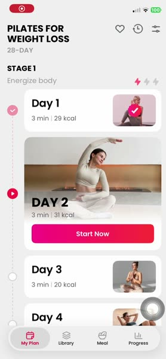 | [00:03 My Plan, Stage 1, ngày hôm nay mở rộng](competitors/chillfit/00-03-plan-day-list.jpg) (A3.2) |
| 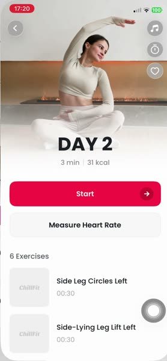 | [00:05 Chi tiết DAY 2](competitors/chillfit/00-05-day-detail.jpg) (A3.3) |
| 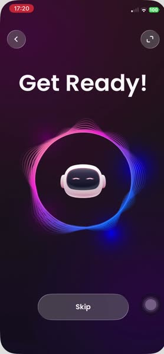 | [00:11 "Get Ready!" robot + Skip](competitors/chillfit/00-11-get-ready-intro.jpg) (A3.4) |
| 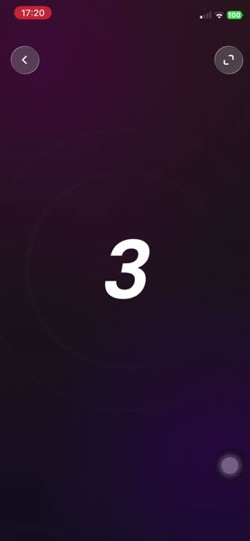 | [00:13 Đếm ngược](competitors/chillfit/00-13-countdown-3-2-1.jpg) (A3.5) |
| 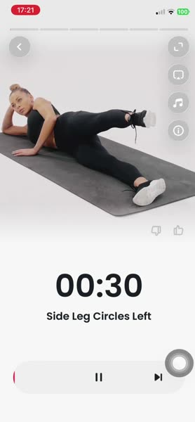 | [00:16 Player 00:30](competitors/chillfit/00-16-player-exercise.jpg) (A3.6) |
| 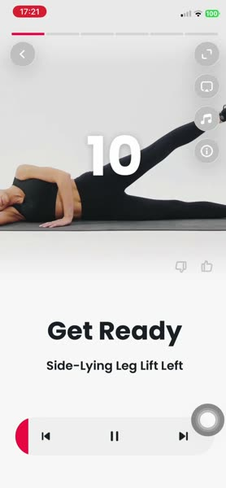 | [00:20 Get Ready động tác kế, số 10](competitors/chillfit/00-20-get-ready-next-move.jpg) (A3.7) |
| 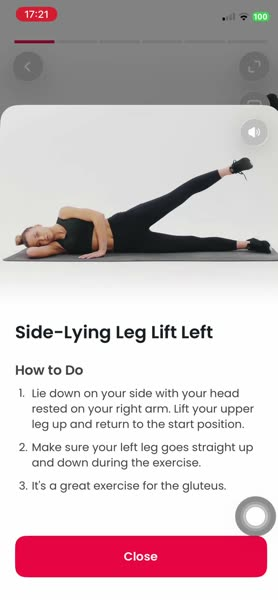 | [00:24 How to Do](competitors/chillfit/00-24-how-to-do-sheet.jpg) (A3.8) |
| 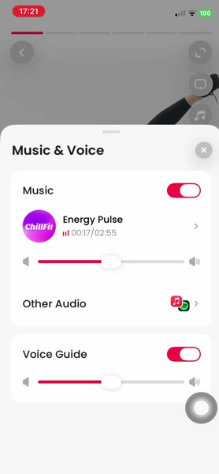 | [00:27 Music & Voice](competitors/chillfit/00-27-music-voice-sheet.jpg) (A3.9) |
| 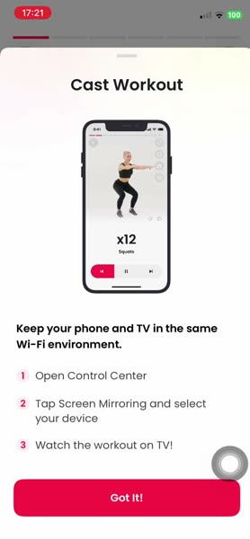 | [00:29 Cast Workout](competitors/chillfit/00-29-cast-workout-sheet.jpg) (A3.10) |
| 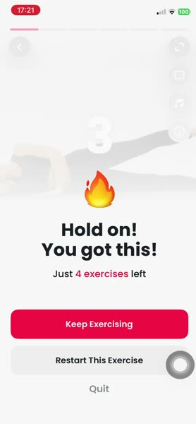 | [00:32 Hold on! You got this!](competitors/chillfit/00-32-quit-dialog.jpg) (A3.12) |
| 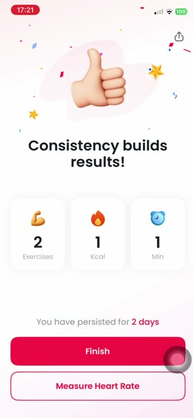 | [00:35 Consistency builds results!](competitors/chillfit/00-35-completion.jpg) (A3.13) |
| 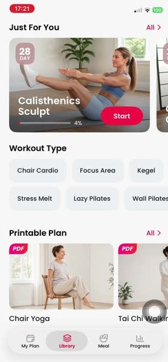 | [00:39 Library: Just For You, Workout Type, PDF](competitors/chillfit/00-39-library-top.jpg) (A3.15) |
| 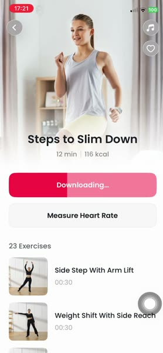 | [01:02 Downloading…](competitors/chillfit/01-02-workout-downloading.jpg) (A3.16) |
| 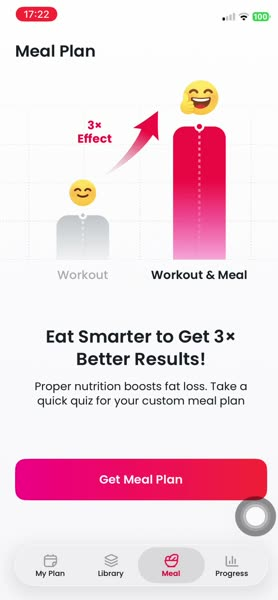 | [01:50 Meal "3× Effect"](competitors/chillfit/01-50-meal-upsell.jpg) (A3.23) |
| 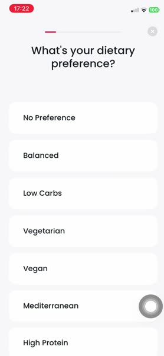 | [01:52 Quiz thực đơn câu 1](competitors/chillfit/01-52-meal-quiz.jpg) (A3.24) |
|  | [02:24 Meal Plan + miễn trừ](competitors/chillfit/02-24-meal-plan-disclaimer.jpg) (A3.26–27) |
| 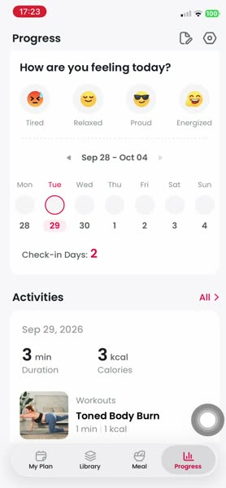 | [02:26 Progress: cảm xúc, lịch, Activities](competitors/chillfit/02-26-progress-feeling-calendar.jpg) (A3.28) |
| 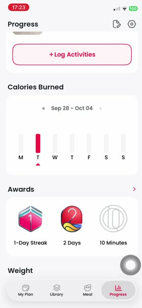 | [02:29 Calories Burned, Awards](competitors/chillfit/02-29-progress-awards.jpg) (A3.28) |
| 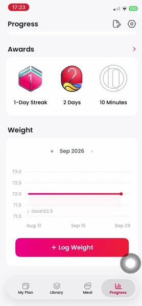 | [02:38 Weight](competitors/chillfit/02-38-progress-weight.jpg) (A3.28) |
| 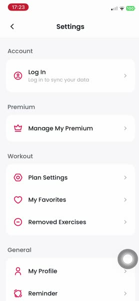 | [02:41 Settings](competitors/chillfit/02-41-settings.jpg) (A3.30) |

### LazyFit (IMG_2136)

| Ảnh | Màn |
|---|---|
| 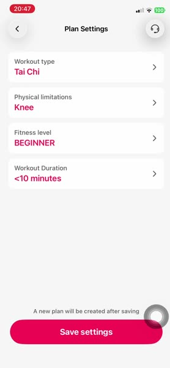 | [00:06 Plan Settings](competitors/lazyfit/00-06-plan-settings.jpg) (B3.2) |
| 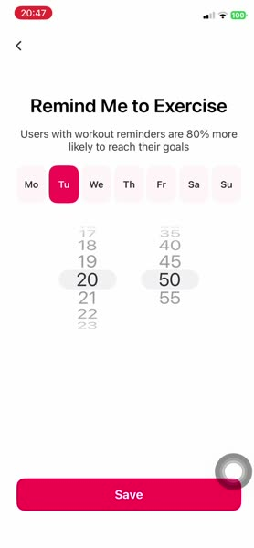 | [00:14 Remind Me to Exercise](competitors/lazyfit/00-14-workout-reminder.jpg) (B3.4) |
| 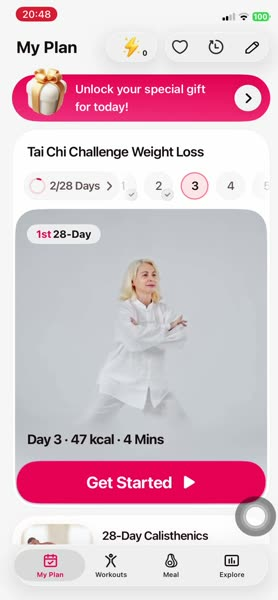 | [00:39 My Plan + banner quà](competitors/lazyfit/00-39-my-plan.jpg) (B3.10) |
|  | [00:43 Special Discount 20% OFF](competitors/lazyfit/00-43-special-discount-paywall.jpg) (B3.11) |
| 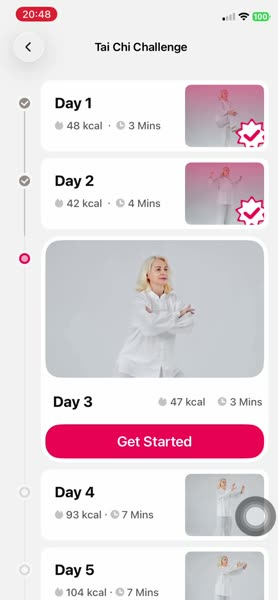 | [00:50 Danh sách ngày Tai Chi Challenge](competitors/lazyfit/00-50-challenge-day-list.jpg) (B3.12) |
| 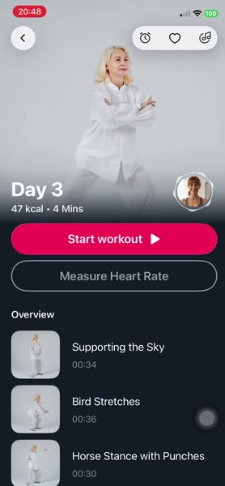 | [00:52 Chi tiết Day 3 (tối)](competitors/lazyfit/00-52-day-detail.jpg) (B3.13) |
| 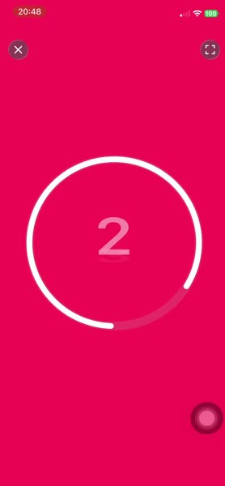 | [00:57 Đếm ngược vòng tròn](competitors/lazyfit/00-57-countdown-ring.jpg) (B3.14) |
| 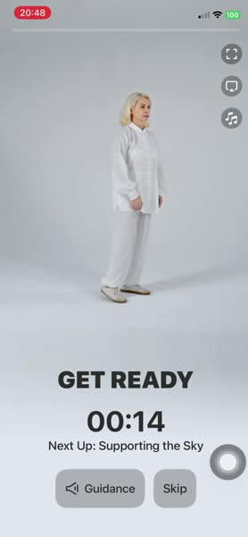 | [01:00 GET READY 00:14, Next Up](competitors/lazyfit/01-00-get-ready-15s.jpg) (B3.15) |
| 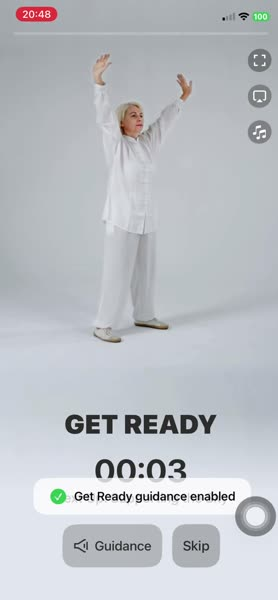 | [01:05 Toast Guidance enabled](competitors/lazyfit/01-05-guidance-toggle-toast.jpg) (B3.15) |
| 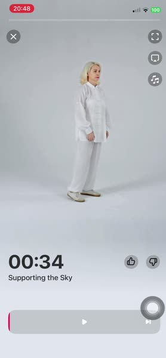 | [01:09 Player đang dừng](competitors/lazyfit/01-09-player-paused.jpg) (B3.16) |
| 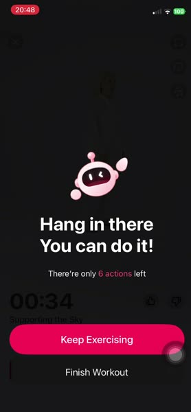 | [01:11 Hang in there](competitors/lazyfit/01-11-quit-dialog.jpg) (B3.17) |
| 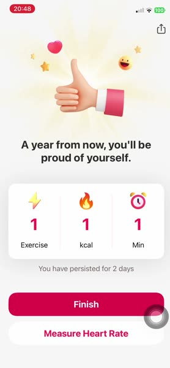 | [01:13 Hoàn thành](competitors/lazyfit/01-13-completion.jpg) (B3.18) |
| 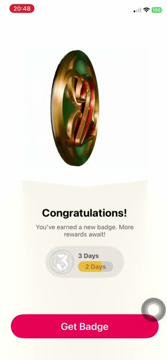 | [01:15 Huy hiệu](competitors/lazyfit/01-15-badge-earned.jpg) (B3.19) |
| 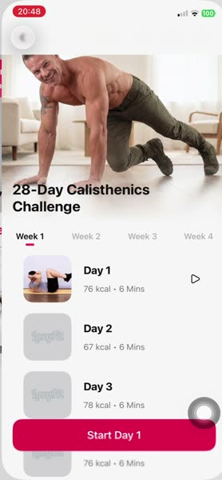 | [01:24 Thử thách Week 1–4](competitors/lazyfit/01-24-challenge-weeks.jpg) (B3.22) |
| 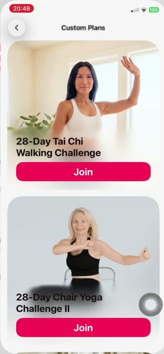 | [01:28 Custom Plans](competitors/lazyfit/01-28-custom-plans.jpg) (B3.23) |
| 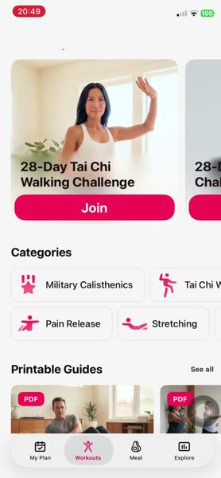 | [01:49 Tab Workouts](competitors/lazyfit/01-49-workouts-tab.jpg) (B3.24) |
| 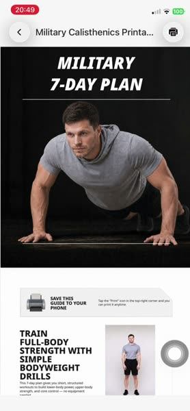 | [02:08 PDF Military 7-Day Plan](competitors/lazyfit/02-08-printable-pdf.jpg) (B3.26) |
| 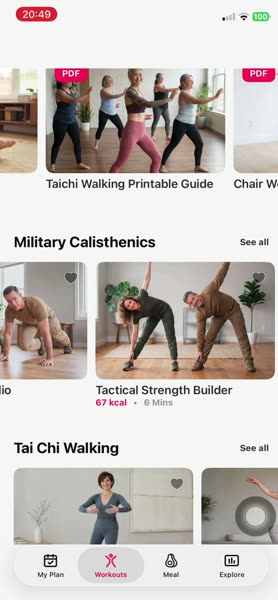 | [02:22 Trending Chair Aerobics](competitors/lazyfit/02-22-trending-chair-aerobics.jpg) (B3.24) |
| 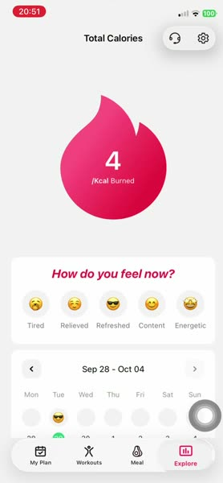 | [03:38 Explore](competitors/lazyfit/03-38-explore-progress.jpg) (B3.31) |
| 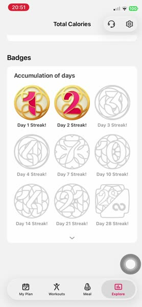 | [03:44 Badges](competitors/lazyfit/03-44-badges.jpg) (B3.31) |

## Câu hỏi còn mở

1. **Tên app theo video:** chữ trên màn cho thấy IMG_2132 là ChillFit và IMG_2136 là LazyFit (ngược với chỉ dẫn ban đầu). Chủ app xác nhận giúp.
2. **Funnel web LazyFit:** chưa bấm qua vì chọn tuổi = chấp nhận Terms/Privacy/Refund. Nếu chủ app đồng ý, có thể bấm tiếp (vẫn dừng trước email) để xác nhận thứ tự câu hỏi và giá web.
3. **Giá web LazyFit** (gói 1/4/12/24 tuần) chưa thấy; giá App Store chưa ghép được với kỳ hạn.
4. **Không thấy trong video:** paywall và onboarding của ChillFit; quiz thực đơn của LazyFit; màn "Rest" riêng (nếu có) ở bài dài; hành vi khi khoá màn hình; âm thanh (giọng, chuông) — tài liệu này không phân tích tiếng.
5. ChillFit có bản Android hay không: không tìm thấy trên Google Play.
